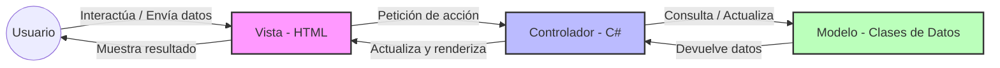

# ADR-01: Selección del Patrón Arquitectónico y Stack Tecnológico para PeakPerformance

| Campo | Valor |
| --- | --- |
| **Autor** | Mateo Martin |
| **Fecha** | 15/05/2026 |
| **Estado** | `Propuesto` |

---

## Contexto

Se está construyendo **PeakPerformance**, una aplicación web enfocada en el sector de fitness y el entrenamiento físico. El sistema está diseñado para que los usuarios puedan registrar sus entrenamientos diarios, planificar rutinas orientadas a la hipertrofia o recomposición corporal, y llevar un control de su progreso físico y nutricional.

Para el desarrollo de esta actividad, existen condiciones y restricciones que influyen directamente en la decisión:

1. **Tiempo disponible:** El proyecto se debe entregar al finalizar el cuatrimestre, por lo que se requiere una estructura clara que no tome demasiado tiempo configurar desde cero.
2. **Conocimientos previos:** En la clase estamos trabajando con el lenguaje **C#** y las bases de lo que hemos aprendido sobre desarrollo web y programación orientada a objetos.
3. **Primer proyecto arquitectónico:** Al ser nuestra primera experiencia documentando software, necesitamos un estilo que sea fácil de entender, implementar y defender ante el profesor.

---

## Decisión

Se decide utilizar el patrón arquitectónico **MVC (Model-View-Controller)** mediante el framework **ASP.NET Core (.NET 8)**, conectando el sistema a una base de datos relacional para guardar la información.

El sistema se estructurará exclusivamente en los tres componentes del patrón:

- **Modelo (Model):** Contiene la estructura de los datos y las clases principales del negocio (como `Usuario`, `Rutina`, `Ejercicio` y `Progreso`).
- **Vista (View):** Son las pantallas de la aplicación con las que interactúa el usuario (diseñadas con HTML y CSS ) para ver sus rutinas y registrar sus pesos.
- **Controlador (Controller):** Es el intermediario. Recibe las peticiones del usuario desde la vista, realiza las operaciones necesarias con los modelos y decide qué pantalla mostrar de vuelta.

### ¿Por qué?

- **Estructura clara y ordenada:** El patrón MVC separa por completo la interfaz gráfica de la lógica y los datos. Esto evita que el código sea un desastre y hace que sea más fácil buscar y corregir errores.
- **Herramientas del framework:** ASP.NET Core permite crear los controladores y las vistas de manera muy rápida mediante plantillas base, lo que nos ahorra tiempo en la programación de los formularios de registro y catálogos de ejercicios.
- **Tecnología vista en clase:** Es la tecnología en la que estamos construyendo nuestras bases de desarrollo, asegurando que dominamos los conceptos que se van a evaluar.

### Alternativas consideradas

| Alternativa | Por qué la descarté |
| --- | --- |
| **Código Spaghetti (Todo en un solo archivo)** | Aunque al principio parece más rápido juntar el HTML con las consultas de datos en un solo archivo, se vuelve imposible de mantener o entender conforme el proyecto crece unas cuantas pantallas. |
| **Desarrollo en Node.js (Express y MongoDB)** | Implica aprender un entorno completamente nuevo fuera de lo requerido en clase. Además, los datos de las rutinas (usuarios, series, repeticiones) tienen relaciones muy marcadas que se manejan mejor en una estructura relacional tradicional. |
| **Separar el Frontend por completo (React / Angular)** | Desarrollar una aplicación independiente para la interfaz y otra diferente para los datos (API) duplica el trabajo y añade configuraciones de red complejas que no corresponden al nivel actual de la materia. |

---

## Consecuencias

** Lo que gano:**

- **Consecuencia técnica:** El código queda perfectamente organizado. Si un botón de la pantalla falla, sabemos que el problema está en la Vista o en el Controlador, sin riesgo de dañar la forma en que se guardan los datos.
- **Consecuencia sobre el proceso:** Al tener los componentes separados, es más fácil dividirse las tareas del proyecto. Mientras se diseñan las pantallas de los diarios de entrenamiento en las Vistas, se puede avanzar programando la lógica de los Controladores al mismo tiempo.

** Lo que sacrifico o asumo:**

- **Limitación técnica:** Al estar todo el código (Modelos, Vistas y Controladores) dentro del mismo proyecto de ASP.NET Core, si la aplicación llega a fallar o el servidor se cae, se detiene todo el sistema por completo (no se pueden separar las pantallas de la base de datos).
- **Deuda o riesgo:** Este patrón está pensado principalmente para páginas web en computadoras. Si en el futuro quisiéramos convertir PeakPerformance en una aplicación móvil para usarla en el gimnasio, las Vistas actuales no nos servirían y tendríamos que reescribir esa parte del código.

---

## Diagrama

Este es el boceto de Nivel 1 que muestra el flujo básico y cerrado del patrón MVC que implementaremos en el proyecto:

