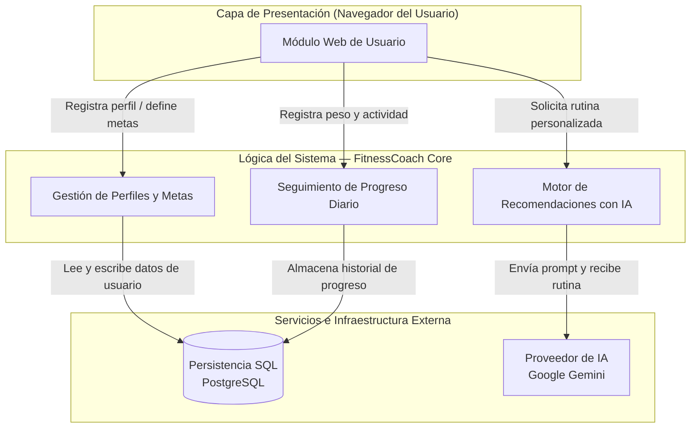
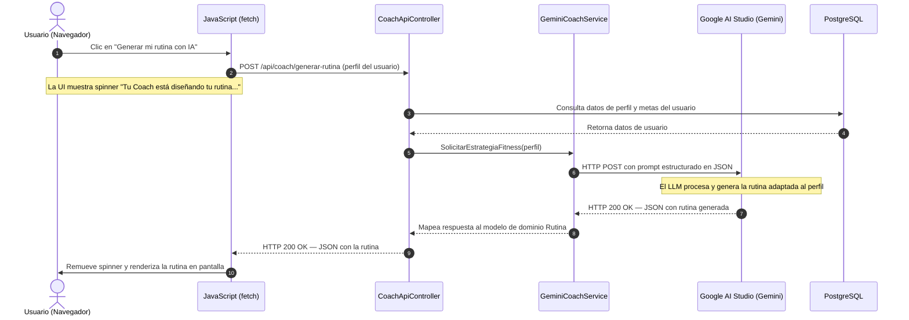
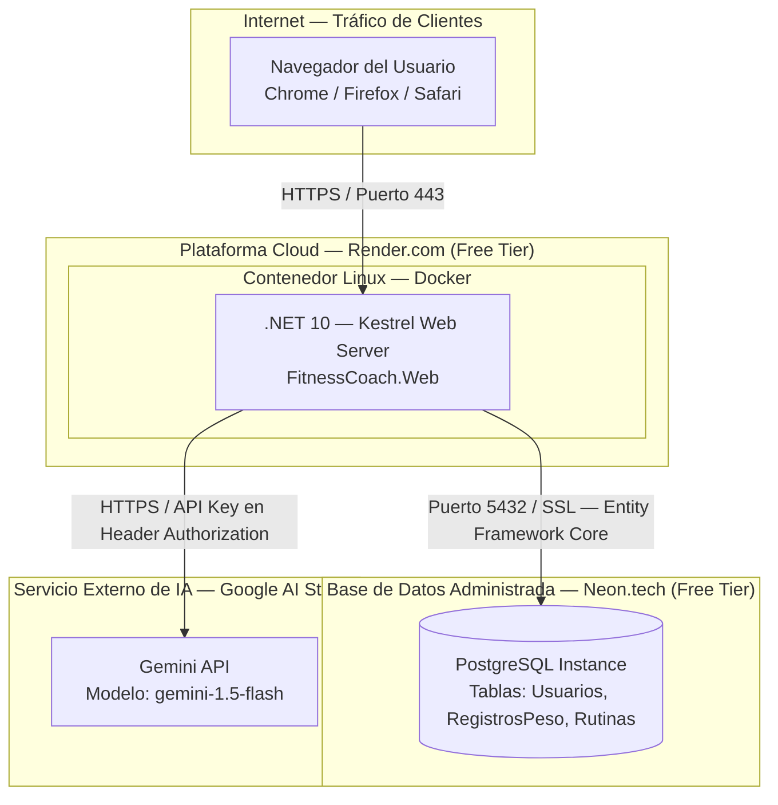

# ADR-03: Definición de Vistas Arquitectónicas para FitnessCoach

| Campo  | Valor          |
|--------|----------------|
| Autor  | Mateo Martin   |
| Fecha  | 04/06/2026     |
| Estado | `Propuesto`    |

---

## Contexto

Para dar continuidad a la evolución de **FitnessCoach**, se requiere definir y documentar las perspectivas del sistema a través de múltiples vistas arquitectónicas. El sistema ha evolucionado de un modelo puramente estático en memoria hacia una plataforma capaz de persistir información de salud/entrenamiento de forma externa e interactuar de manera asíncrona con modelos de lenguaje masivos (LLM) para la generación automatizada de rutinas y planes nutricionales.

Un solo diagrama no puede responderle a todos los interesados del sistema. Por eso se adoptan cuatro vistas complementarias: cada una responde a una audiencia específica y muestra solo los aspectos que le son relevantes.

---

## Decisión

Se adopta el modelo de **Cuatro Vistas Arquitectónicas** para segmentar y describir la estructura del sistema según las necesidades de los diferentes interesados: product owner, desarrolladores, arquitecto y administrador de sistemas.

El proyecto mantiene un **enfoque híbrido MVC**: las vistas tradicionales (registro, inicio de sesión, historial de peso) utilizan el patrón MVC estándar de ASP.NET Core, mientras que la integración con IA se expone como un `ApiController` asíncrono para evitar bloqueos de renderizado durante las llamadas al LLM externo.

---

## Vistas Arquitectónicas

### 1. Vista Lógica — ¿Qué hace el sistema?

**Para quién:** Product owner y equipo de desarrollo.

Muestra las responsabilidades funcionales de FitnessCoach: qué módulos existen y qué hace cada uno. No muestra cómo está escrito el código ni dónde corre.



**Lo que muestra:** los módulos funcionales, sus responsabilidades y la naturaleza de cada relación.  
**Lo que NO muestra:** cómo está organizado el código ni dónde corre físicamente.

---

### 2. Vista de Desarrollo — ¿Cómo está organizado el código?

**Para quién:** Desarrolladores del equipo.

Muestra la estructura de la solución `.sln` en Visual Studio y las dependencias entre proyectos, aplicando el principio de **Inversión de Dependencias** (SOLID): los proyectos de alto nivel (`Web` e `Infrastructure`) dependen de las abstracciones definidas en `Core`, nunca al revés.

```
FitnessCoach.sln
├── FitnessCoach.Core          ← Usuario, RegistroPeso, Rutina, IUsuarioRepository, ICoachService
├── FitnessCoach.Infrastructure ← AppDbContext (PostgreSQL), GeminiCoachService
└── FitnessCoach.Web
    ├── Controllers/           ← MVC tradicional: AuthController, PerfilController, HistorialController
    ├── ApiControllers/        ← Asíncrono con IA: CoachApiController
    └── Views/                 ← .cshtml — Razor Pages
```

**Lo que muestra:** qué proyecto depende de cuál y por qué — el `Core` no depende de nadie, `Infrastructure` y `Web` dependen del `Core`.  
**Lo que NO muestra:** dónde corre el sistema ni qué procesos hay en ejecución.

---

### 3. Vista de Procesos — ¿Cómo se comporta en ejecución?

**Para quién:** Dev senior y arquitecto.

Muestra el flujo de ejecución del caso de uso más relevante del sistema: la generación asíncrona de una rutina personalizada con IA. Se eligió un diseño asíncrono para mitigar la latencia de 5–8 segundos del LLM sin bloquear el renderizado del servidor.



**Lo que muestra:** flujos en tiempo de ejecución, comunicación síncrona (BD) vs asíncrona (IA) y el manejo de latencia con JavaScript.  
**Lo que NO muestra:** dónde está desplegado físicamente el sistema.

---

### 4. Vista de Despliegue — ¿Dónde vive físicamente?

**Para quién:** DevOps y administrador de sistemas.

Describe la topología de infraestructura proyectada para el entorno productivo bajo un esquema de costos optimizado (Free-Tier). No se requiere tenerlo desplegado — documenta lo planeado.



**Lo que muestra:** servidores, contenedores, redes y cómo llega el tráfico con tecnología concreta nombrada.  
**Lo que NO muestra:** cómo está organizado el código internamente.

---

## Coherencia entre las cuatro vistas

El mismo sistema, cuatro perspectivas:

| Vista        | Audiencia                   | Artefacto                        | Elemento central en FitnessCoach         |
|--------------|-----------------------------|----------------------------------|------------------------------------------|
| Lógica       | Product owner, dev team     | Diagrama de componentes          | Módulos: Perfiles, Progreso, Motor de IA |
| Desarrollo   | Desarrolladores             | Estructura `.sln` / C4 Nivel 3   | `FitnessCoach.Core` como núcleo SOLID    |
| Procesos     | Dev senior, arquitecto      | Diagrama de secuencia            | Flujo asíncrono de generación de rutina  |
| Despliegue   | DevOps, sysadmin            | Diagrama de infraestructura      | Render + Neon + Google AI Studio         |

---

## Consecuencias

### ✅ Lo que gano

- **Claridad para cada audiencia:** cada vista responde a una pregunta específica sin mezclar responsabilidades, tal como lo requiere el modelo de las cuatro vistas.
- **Experiencia de Usuario (UX) moderna:** el diseño asíncrono documentado en la Vista de Procesos elimina los bloqueos de renderizado de MVC durante operaciones pesadas de IA.
- **Arquitectura desacoplada:** la Vista de Desarrollo evidencia que migrar de proveedor de IA (Gemini → OpenAI) o de base de datos solo requiere modificar `FitnessCoach.Infrastructure`, sin tocar `Core` ni `Web`.
- **Infraestructura costo-cero en desarrollo:** la Vista de Despliegue documenta una topología funcional con Free-Tier que puede evolucionar a producción pagada sin cambiar la arquitectura.

### ⚠️ Lo que sacrifico o asumo

- **Complejidad del código:** integrar controladores híbridos (MVC + ApiControllers) requiere dominar inyección de dependencias y `fetch` asíncrono en JavaScript.
- **Dependencia de servicios externos:** la generación de rutinas depende de la disponibilidad y las cuotas gratuitas de Google AI Studio. Si el servicio cae, el sistema debe manejar la excepción de forma limpia sin afectar el resto de las funcionalidades MVC.
- **Sin redundancia en el despliegue inicial:** un solo contenedor en Render sin balanceador de carga implica que si el servicio cae, la app no está disponible — trade-off consciente a favor del costo bajo en esta etapa del proyecto.
