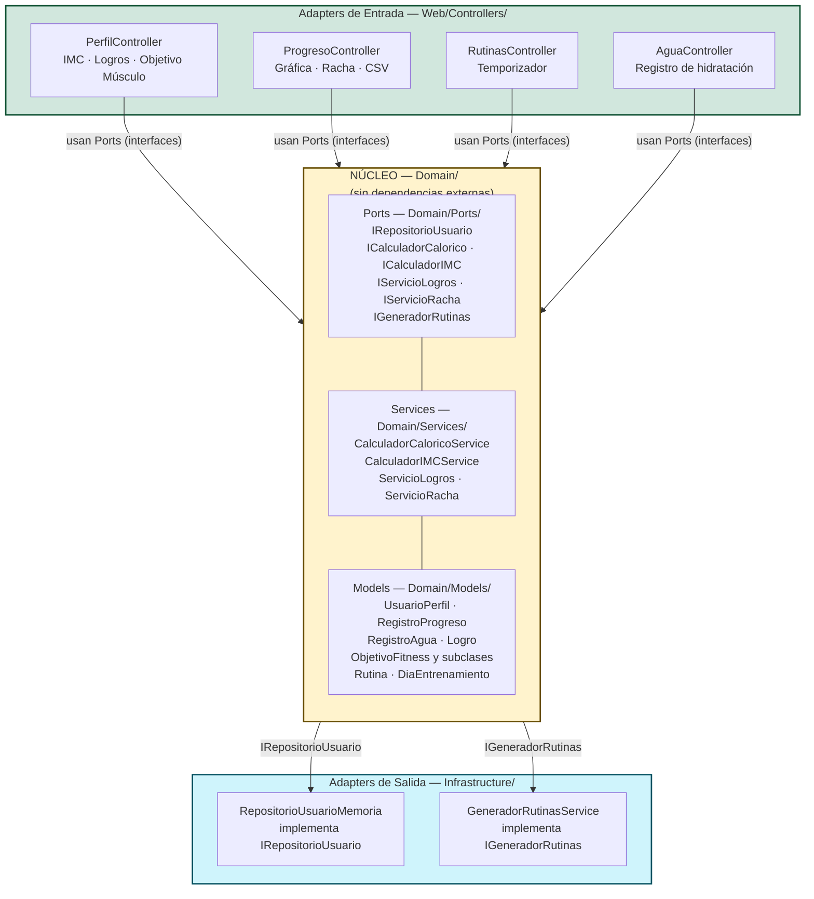

# ADR-04: Estilo Arquitectónico de FitnessCoach — Arquitectura Hexagonal (Ports & Adapters) en un solo proyecto

| Campo  | Valor          |
|--------|----------------|
| Autor  | Mateo Martin   |
| Fecha  | 12/06/2026     |
| Estado | `Propuesto`    |

> **Relación con ADRs anteriores:** Este ADR complementa el ADR-02 (patrón MVC) y el ADR-03 (cuatro vistas arquitectónicas). El ADR-02 eligió MVC como patrón de presentación; este ADR decide el **estilo arquitectónico a nivel de solución**, que trasciende al patrón de UI.

---

## Contexto

FitnessCoach es una aplicación web de seguimiento fitness desarrollada con ASP.NET Core MVC. En su estado actual, el proyecto funciona con persistencia en memoria y tiene tres módulos operativos: configuración de perfil del usuario, seguimiento de progreso de peso e historial, y generación de rutinas de entrenamiento.

El crecimiento natural del sistema hacia nuevas funcionalidades — registro de hidratación diaria, cálculo de IMC con clasificación clínica, sistema de logros, gráfica de progreso, exportación de datos, temporizador de series y racha de días consecutivos — plantea una pregunta de diseño que el ADR-02 no respondía: **¿cómo se organiza el código internamente para que agregar cada nueva funcionalidad no implique modificar lo que ya funciona?**

Con la estructura actual de carpetas planas (`Controllers/`, `Models/`, `Services/`, `Repositories/`), las capas son implícitas — no hay ninguna frontera que impida que un Controller acceda directamente a un repositorio concreto, o que un servicio dependa de otro servicio de infraestructura. Al agregar más funcionalidades, el riesgo de mezclar responsabilidades crece.

**Características del sistema que hacen relevante esta decisión:**

- El repositorio de usuario (`IRepositorioUsuario`) y el servicio de cálculo calórico (`ICalculadorCalorico`) ya existen como interfaces — el proyecto tiene Ports definidos sin haberlos nombrado así.
- Todas las funcionalidades nuevas (IMC, logros, racha, agua diaria) son **lógica de dominio pura** — no dependen de ningún framework ni de servicios externos. Pueden vivir en el núcleo sin ninguna dependencia hacia afuera.
- El sistema es un proyecto individual académico. Crear tres proyectos separados (`.slnx` multi-proyecto) agrega overhead de configuración de referencias y DI que no está justificado en esta etapa.
- El despliegue proyectado es un contenedor Docker en Render.com Free Tier — un solo ejecutable, sin orquestación de múltiples servicios.

---

## Decisión

Se adopta el estilo de **Arquitectura Hexagonal (Ports & Adapters)** implementado dentro de un **único proyecto `.csproj`**, reorganizando la estructura de carpetas para hacer explícitas las fronteras que ya existen implícitamente.

La regla central es la misma que en cualquier implementación hexagonal: el núcleo de negocio no depende de nada externo. Los Ports son las interfaces; los Adapters son las implementaciones concretas.

### Estructura de carpetas objetivo

```
FitnessCoach/
├── Domain/
│   ├── Models/
│   │   ├── UsuarioPerfil.cs
│   │   ├── RegistroProgreso.cs
│   │   ├── RegistroAgua.cs              ← nuevo
│   │   ├── Logro.cs                     ← nuevo
│   │   ├── Objetivos/
│   │   │   ├── ObjetivoFitness.cs
│   │   │   ├── ObjetivoPerderPeso.cs
│   │   │   ├── ObjetivoGanarMusculo.cs  ← activado en UI
│   │   │   └── ObjetivoRecomposicion.cs
│   │   └── Entrenamiento/
│   │       ├── Rutina.cs
│   │       ├── DiaEntrenamiento.cs
│   │       └── Ejercicio.cs
│   ├── Ports/                           ← antes: Repositories/ e interfaces de Services/
│   │   ├── IRepositorioUsuario.cs
│   │   ├── ICalculadorCalorico.cs
│   │   ├── IGeneradorRutinas.cs
│   │   ├── ICalculadorIMC.cs            ← nuevo
│   │   ├── IServicioLogros.cs           ← nuevo
│   │   └── IServicioRacha.cs            ← nuevo
│   └── Services/                        ← lógica de negocio pura, sin dependencias externas
│       ├── CalculadorCaloricoService.cs
│       ├── CalculadorIMCService.cs      ← nuevo
│       ├── ServicioLogros.cs            ← nuevo
│       └── ServicioRacha.cs             ← nuevo
├── Infrastructure/                      ← Adapters: implementaciones concretas
│   ├── RepositorioUsuarioMemoria.cs     ← movido desde Repositories/
│   └── GeneradorRutinasService.cs       ← movido desde Services/
└── Web/                                 ← Adapters de entrada
    ├── Controllers/
    │   ├── HomeController.cs
    │   ├── PerfilController.cs
    │   ├── ProgresoController.cs        ← agrega ExportarCSV y gráfica
    │   ├── RutinasController.cs         ← agrega temporizador
    │   └── AguaController.cs            ← nuevo
    └── Views/
        ├── Perfil/Index.cshtml          ← agrega IMC, logros, objetivo Ganar Músculo
        ├── Progreso/Index.cshtml        ← agrega Chart.js y racha
        ├── Rutinas/Index.cshtml         ← agrega temporizador JS
        └── Agua/Index.cshtml            ← nuevo
```

### Por qué uniproyecto y no multi-proyecto

Las diapositivas de clase identifican tres niveles de aplicación del estilo hexagonal:

- **Solo capas** → simple, funciona, difícil de extender
- **Hexagonal en un proyecto** → más flexible, mediana complejidad ← **esta decisión**
- **Hexagonal multi-proyecto** → máxima flexibilidad, más configuración

La separación en múltiples `.csproj` requiere gestionar referencias entre proyectos, resolver conflictos de namespace entre ensamblados y configurar la inyección de dependencias con mayor cuidado. Para un proyecto individual en etapa académica donde la prioridad es implementar funcionalidades reales, el overhead de multi-proyecto no agrega valor proporcional al esfuerzo. Los principios hexagonales — núcleo sin dependencias externas, interfaces como contratos, implementaciones en la periferia — se aplican igualmente a nivel de carpetas dentro de un solo proyecto.

---

## Diagrama del Estilo Arquitectónico Aplicado



**Port** = interfaz en `Domain/Ports/` que define el contrato (`ICalculadorIMC`, `IServicioLogros`).  
**Adapter de salida** = clase en `Infrastructure/` que implementa ese contrato (`RepositorioUsuarioMemoria`).  
**Adapter de entrada** = Controller en `Web/Controllers/` que consume los Ports vía inyección de dependencias.  
El núcleo (`Domain/`) no tiene ninguna referencia hacia `Infrastructure/` ni hacia `Web/`.

---

## Funcionalidades que activa esta arquitectura

La reorganización hexagonal hace que cada nueva funcionalidad tenga un lugar claro y no contamine el código existente:

| Funcionalidad | Tipo | Dónde vive |
|---|---|---|
| IMC con clasificación clínica | Lógica de dominio | `Domain/Services/CalculadorIMCService.cs` |
| Objetivo "Ganar Músculo" en UI | Activar clase existente | `PerfilController` + `Perfil/Index.cshtml` |
| Gráfica de progreso de peso | Visualización | `Progreso/Index.cshtml` + Chart.js |
| Racha de días consecutivos | Lógica de dominio | `Domain/Services/ServicioRacha.cs` |
| Exportar historial a CSV | Adapter de entrada | `ProgresoController.ExportarCSV()` |
| Temporizador de series | Frontend puro | `Rutinas/Index.cshtml` JS |
| Sistema de logros | Lógica de dominio | `Domain/Services/ServicioLogros.cs` |
| Registro de agua diaria | Nuevo módulo completo | `AguaController` + `Agua/Index.cshtml` |

---

## Alternativas Consideradas

### Alternativa 1: Mantener solo capas con carpetas planas (estado actual)

Conservar la estructura `Controllers/`, `Models/`, `Services/`, `Repositories/` sin reorganizar.

**Por qué se descarta:**  
Al agregar ocho funcionalidades nuevas sobre una estructura plana, `Services/` se convierte en una carpeta con lógica de dominio pura (`CalculadorIMCService`, `ServicioLogros`, `ServicioRacha`) mezclada con lógica de infraestructura (`GeneradorRutinasService`, que tiene rutinas hardcodeadas y podría eventualmente llamar a una API). No hay ninguna frontera que señale cuál código puede cambiar sin riesgo y cuál no. La arquitectura hexagonal resuelve exactamente eso: `Domain/Services/` solo contiene lógica pura; `Infrastructure/` contiene todo lo que puede cambiar.

---

### Alternativa 2: Hexagonal multi-proyecto

Separar el código en tres proyectos: `FitnessCoach.Domain`, `FitnessCoach.Infrastructure` y `FitnessCoach.Web`.

**Por qué se descarta:**  
La separación física en ensamblados distintos es el nivel máximo de aplicación del estilo hexagonal — garantiza en tiempo de compilación que `Domain` no puede referenciar `Infrastructure`. Sin embargo, para un proyecto individual sin equipo distribuido, el costo de configuración supera el beneficio. Hay que gestionar referencias entre proyectos en el `.slnx`, resolver posibles conflictos de namespaces entre ensamblados y mantener el registro de DI más explícito. La separación por carpetas dentro de un solo proyecto comunica las mismas intenciones arquitectónicas con menos fricción operativa.

---

### Alternativa 3: Microservicios

Separar cada módulo (perfil, progreso, rutinas, agua) en un servicio independiente con su propio despliegue.

**Por qué se descarta:**  
Los microservicios son adecuados para equipos grandes con módulos que escalan de forma independiente. FitnessCoach es un proyecto individual donde todos los módulos comparten el mismo usuario y el mismo estado. Introducir comunicación HTTP entre servicios internos, orquestación y descubrimiento de servicios agregaría complejidad operativa que no está justificada en esta escala ni en el despliegue proyectado en Render.com Free Tier.

---

### Alternativa 4: Event-driven

Comunicar los módulos mediante eventos: registrar peso dispara un evento que `ServicioLogros` y `ServicioRacha` consumen.

**Por qué se descarta:**  
Event-driven es adecuado cuando múltiples sistemas independientes reaccionan al mismo hecho sin conocerse entre sí. En FitnessCoach, los flujos son lineales y síncronos — el usuario registra peso y espera ver la tabla actualizada, su racha y sus logros en la misma respuesta. Llamar directamente a `ServicioLogros` y `ServicioRacha` desde el Controller es más simple, igualmente correcto, y no requiere infraestructura de mensajería.

---

## Consecuencias

### ✅ Lo que gano

- **Cada nueva funcionalidad tiene un lugar inequívoco:** si es lógica pura (calcular IMC, detectar racha, evaluar logros), va en `Domain/Services/`. Si accede a algo externo o tiene datos hardcodeados, va en `Infrastructure/`. Si maneja una petición HTTP, va en `Web/Controllers/`. La pregunta "¿dónde va este código?" siempre tiene respuesta.
- **El núcleo es testeable en aislamiento:** `CalculadorIMCService`, `ServicioLogros` y `ServicioRacha` no dependen de repositorios ni de frameworks — pueden probarse con datos directos sin levantar la app.
- **Sustituir el repositorio en memoria no toca el dominio:** si en el futuro se conecta una base de datos real, se crea un nuevo Adapter en `Infrastructure/` que implementa `IRepositorioUsuario` y se cambia el registro en `Program.cs`. `Domain/` y `Web/` no se tocan.
- **Las funcionalidades nuevas son aditivas:** agregar registro de agua, logros o racha no requiere modificar ningún Controller ni servicio existente — se agregan nuevos Ports, nuevas implementaciones en `Domain/Services/` y nuevos Controllers en `Web/`.

### ⚠️ Lo que sacrifico o asumo

- **La frontera es por convención, no por compilador:** a diferencia del multi-proyecto, nada impide técnicamente que alguien en `Domain/Services/` haga `using FitnessCoach.Infrastructure`. La disciplina de respetar la separación depende del desarrollador, no del compilador.
- **La reorganización de carpetas requiere actualizar todos los namespaces:** mover `Repositories/` a `Domain/Ports/` y `Infrastructure/` implica actualizar las declaraciones `namespace` y los `using` en cada archivo afectado. Es un costo único de refactorización, no recurrente.
- **Sin persistencia entre reinicios:** el Adapter actual (`RepositorioUsuarioMemoria`) almacena datos en memoria. Si el servidor se reinicia, el historial de peso, los registros de agua y los logros se pierden. Es un trade-off consciente aceptado para esta etapa del proyecto; la arquitectura hexagonal facilita reemplazarlo por un Adapter con archivo JSON o base de datos en el futuro.

---
