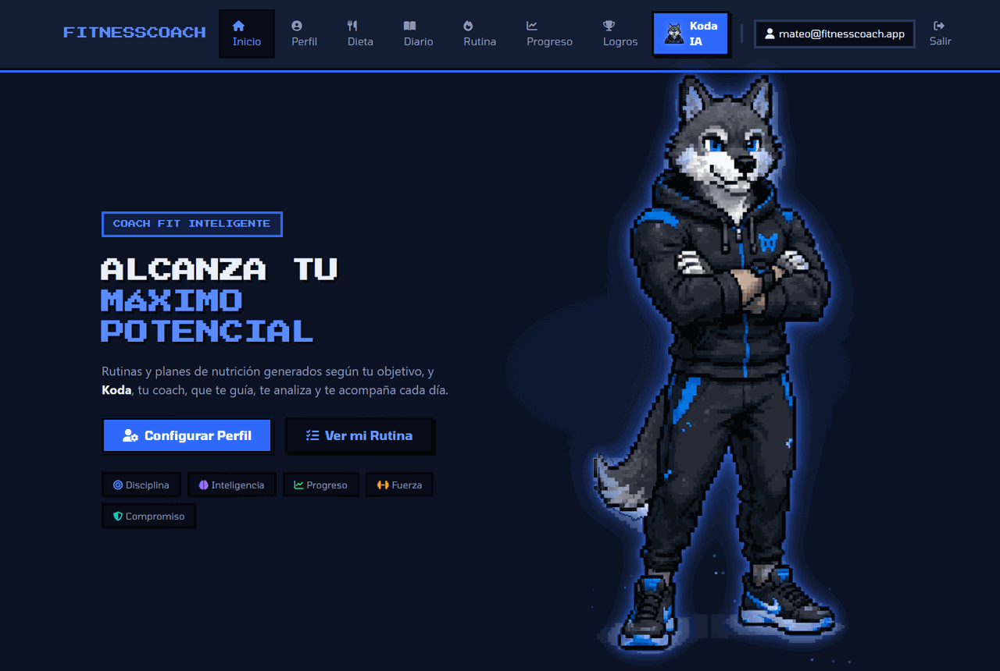
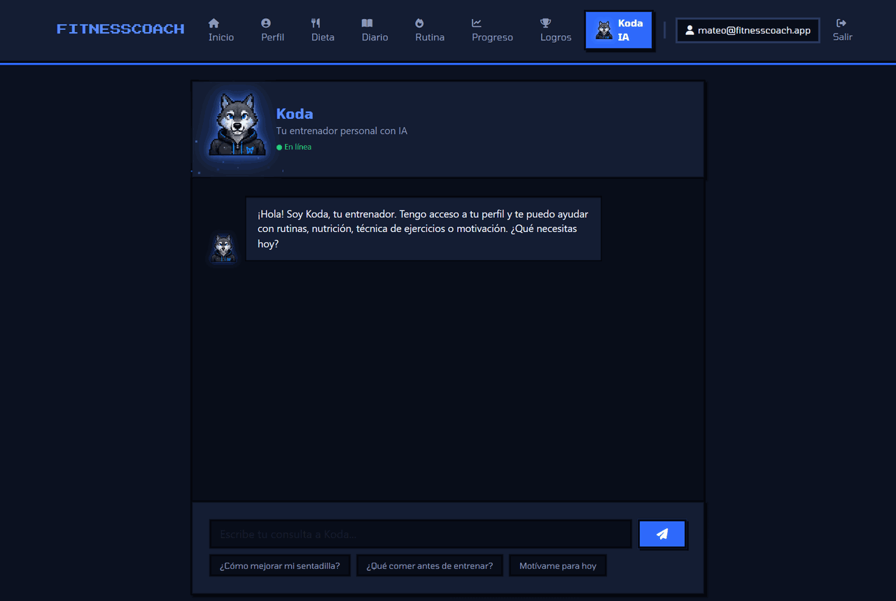
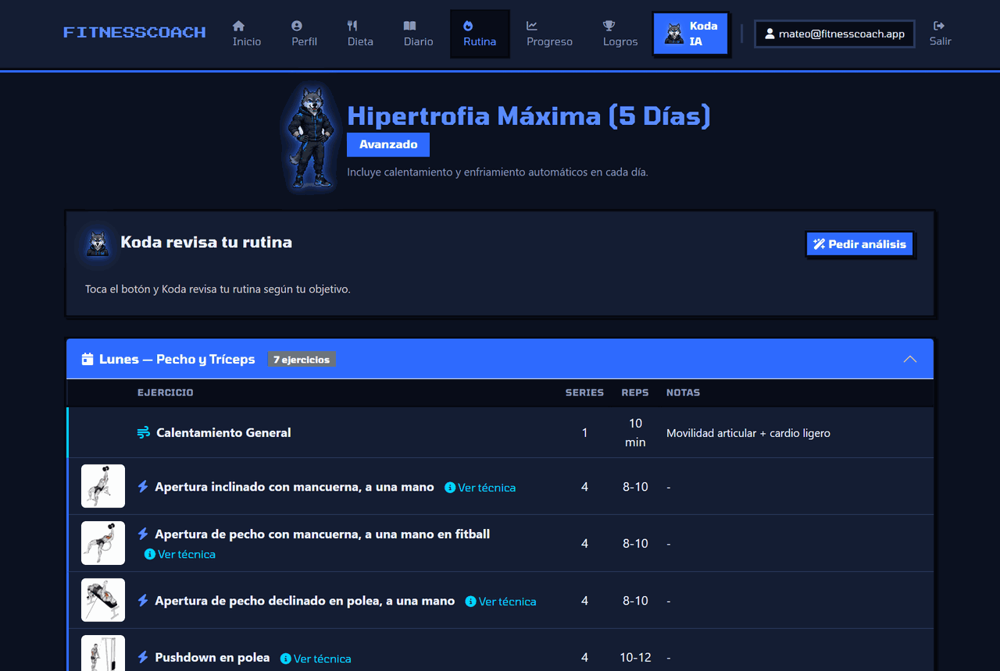
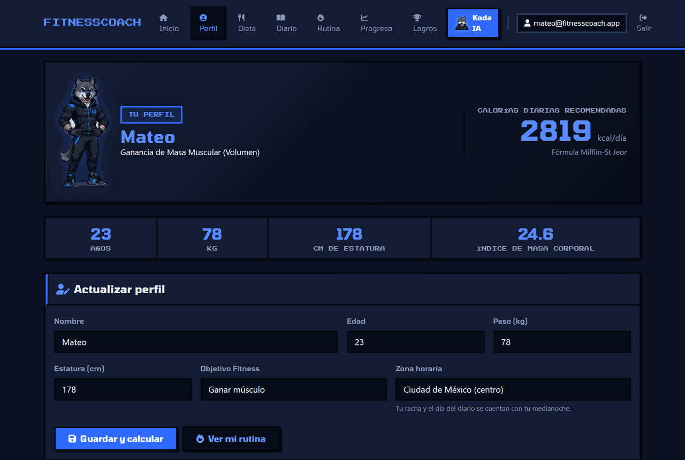
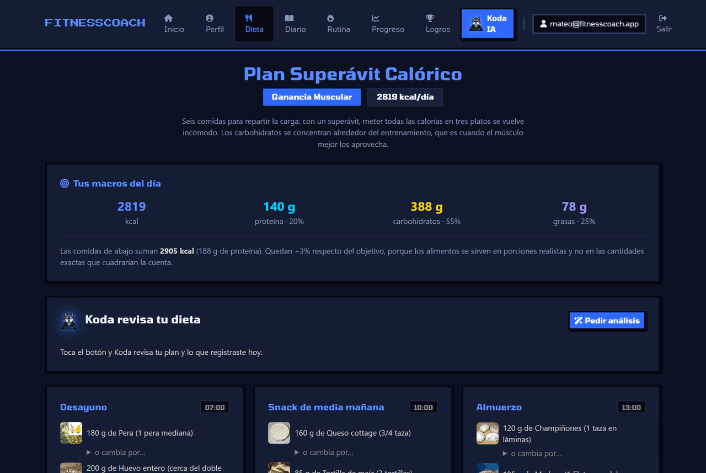
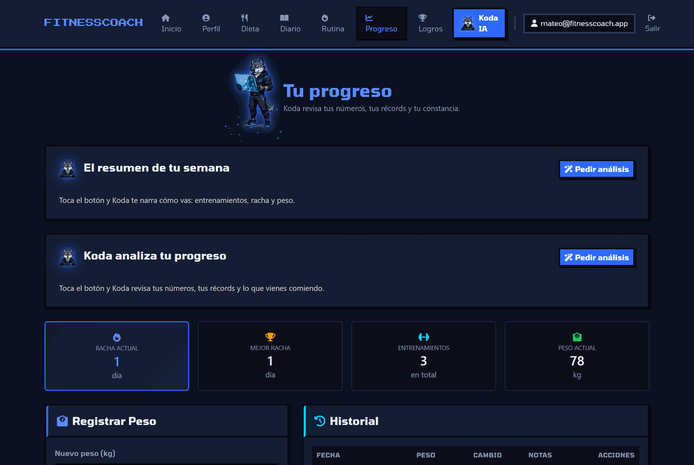
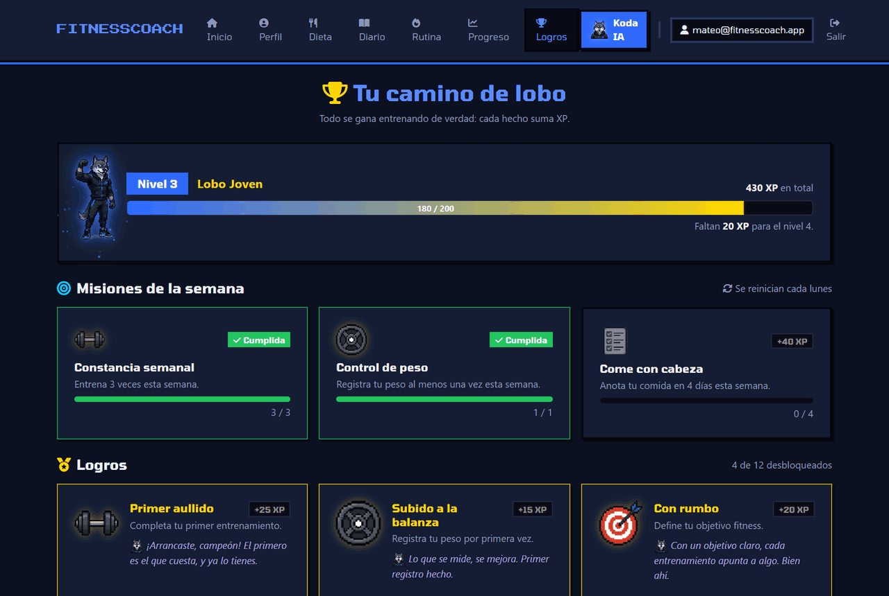
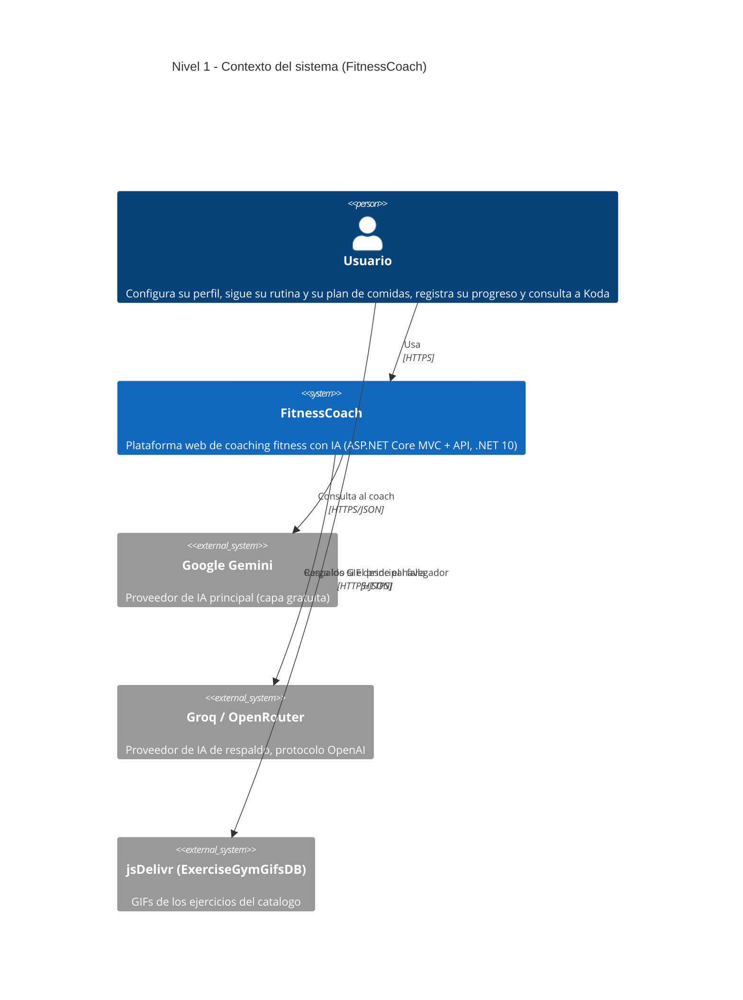

<div align="center">


# FitnessCoach

**Entrenador personal con IA: rutinas, nutrición y un coach que mira tus datos reales.**

Proyecto académico de Arquitectura de Software — Tecnológico de Software


</div>

---

## Índice

1. [Qué es](#qué-es)
2. [Capturas](#capturas)
3. [Funcionalidades](#funcionalidades)
4. [Arquitectura](#arquitectura)
5. [Diagramas C4](#diagramas-c4)
6. [Patrones de diseño](#patrones-de-diseño)
7. [Tecnologías](#tecnologías)
8. [Cómo correrlo](#cómo-correrlo)
9. [Pruebas y calidad](#pruebas-y-calidad)
10. [Documentación](#documentación)
11. [Despliegue](#despliegue)
12. [Ramas del repositorio](#ramas-del-repositorio)
13. [Cláusula de uso de IA](#cláusula-de-uso-de-ia)

---

## Qué es

FitnessCoach arma la **rutina** de cada usuario desde un catálogo de **1323 ejercicios** con GIF e instrucciones, y su **plan de comidas** desde un catálogo de **67 alimentos** con macros de la USDA. Encima hay un tracker (peso, entrenamientos, récords, diario de comidas), una capa de gamificación derivada de esos hechos, y **Koda**: un coach con IA que responde y analiza el progreso, la dieta, la rutina y la semana **con los datos reales del usuario, sin inventar**.

Lo que lo distingue de un CRUD de gimnasio:

- **Nada de contenido escrito a mano en el código.** Rutinas y planes de comida se *componen* desde datos, aplicando estrategias por objetivo.
- **La IA no puede inventar.** Recibe el perfil, el plan, la rutina, el diario y el catálogo, con reglas explícitas de no fabricar datos. Si ningún proveedor responde, un coach offline contesta por reglas: **nunca se cae**.
- **La gamificación se deriva, no se guarda.** Nivel, XP, logros y misiones se calculan desde el tracker, así que no puede desincronizarse con la realidad.
- **Cada decisión está documentada.** 21 ADRs, un inventario de deuda técnica y un roadmap de 12 fases.

---

## Capturas

<div align="center">

### Inicio y Koda




### Rutina generada desde el catálogo



### Perfil y plan de alimentación




### Progreso y logros




</div>

---

## Funcionalidades

| Área | Qué hace |
|------|----------|
| **Cuentas** | Registro, login y logout con ASP.NET Identity. Los datos de cada usuario están aislados: el dueño sale de la identidad, nunca de la URL. |
| **Perfil** | Datos físicos, objetivo, zona horaria (autodetectada del navegador) y calorías diarias por Mifflin-St Jeor. |
| **Rutina** | Compuesta por objetivo desde el catálogo, con calentamiento y enfriamiento automáticos, GIF, instrucciones y técnica de cada ejercicio. |
| **Alimentación** | Macros calculados (proteína por peso, grasa por % del total, carbohidratos por diferencia), plan armado desde el catálogo, sustituciones por equivalencia de macros y preferencias (dietas y alimentos excluidos). |
| **Diario** | Registro de lo comido por día, con barras contra el objetivo. |
| **Progreso** | Historial de peso con gráfica, entrenamientos completados, rachas y récords personales por ejercicio. |
| **Logros** | Nivel y XP, 12 logros y 3 misiones semanales, derivados de los hechos del tracker. |
| **Koda (IA)** | Chat y análisis por pantalla, con cadena de proveedores y respaldo offline. |
| **API REST** | Documentada con OpenAPI + Scalar. Cubre perfil, calorías, historial de peso (alta, edición, borrado) y entrenamientos con rachas. |

---

## Arquitectura

**Hexagonal (Ports & Adapters)** en cuatro proyectos. La regla que la sostiene: las dependencias apuntan **hacia** el dominio.

```
FitnessCoach.Domain          # Modelos, puertos, cálculo puro y patrones GOF. No referencia a nadie.
FitnessCoach.Application     # Servicios de aplicación y casos de uso. Solo referencia Domain.
FitnessCoach.Infrastructure  # Adaptadores: EF Core + SQL Server, Identity, proveedores de IA.
FitnessCoach (raíz)          # Controladores MVC y API, vistas Razor. Program.cs es el composition root.
FitnessCoach.Tests           # xUnit, sin Moq (dobles a mano). No referencia Infrastructure (ADR-08).
```

Que `Domain` no referencie a nadie es lo que permite, por ejemplo, cambiar SQL Server por PostgreSQL o sumar un
proveedor de IA nuevo **sin tocar una sola regla de negocio**.

---

## Diagramas C4

Los diagramas completos, en Mermaid y renderizados por GitHub, están en
**[docs/diagrama-arquitectura.md](docs/diagrama-arquitectura.md)**: contexto, contenedores, componentes y la cadena de
proveedores de IA.

### Nivel 1 — Contexto



> Si ninguno de los proveedores de IA responde, la cadena cae a un coach **offline** que contesta por reglas locales.
> Verificado en la prueba de fuego de la Fase 10.

---

## Patrones de diseño

| Patrón | Dónde | Para qué |
|--------|-------|----------|
| **Strategy** | `Domain/Patterns/Strategy/` | Una estrategia por objetivo, para rutinas y para alimentación. |
| **Decorator** | `Domain/Patterns/Decorator/` y `Infrastructure/Repositories/*EnCache` | Calentamiento y enfriamiento sobre cualquier rutina; y la caché de catálogos, que envuelve al adaptador SQL implementando el mismo puerto. |
| **Factory Method** | `ObjetivoFitnessFactory`, `FabricaProveedoresIA` | Reconstruir el objetivo desde la BD; armar los proveedores de IA según la configuración disponible. |
| **Chain of Responsibility** | `Application/Coaching/CoachResiliente` | Recorrer los proveedores de IA hasta que uno responda, con el offline como último eslabón que no puede fallar. |

---

## Tecnologías

| | Tecnología | Para qué se usa |
|---|---|---|
|  | **.NET 10 / ASP.NET Core** | MVC y Web API en un mismo proceso |
|  | **C#** | Todo el backend |
|  | **EF Core 10** | Persistencia, migraciones y tipos owned |
|  | **SQL Server** | LocalDB en desarrollo, Express al desplegar |
|  | **Bootstrap 5** | Grilla y componentes base, sobre un sistema de diseño propio |
|  | **JavaScript vanilla** | La capa de vida de Koda y las medallas en canvas, sin librerías |
|  | **Gemini / Groq** | Proveedores de IA, ambos en capa gratuita |
|  | **OpenAPI + Scalar** | Documentación viva de la API |
|  | **GitHub Actions** | Integración continua en cada push y PR |

---

## Cómo correrlo

```bash
# 1. Restaurar y compilar
dotnet restore
dotnet build

# 2. Crear la base (LocalDB por defecto, ver appsettings.json)
dotnet ef database update --project FitnessCoach.Infrastructure --startup-project FitnessCoach.csproj

# 3. Levantar
dotnet run --project FitnessCoach.csproj
```

Los catálogos de ejercicios y alimentos se siembran solos al arrancar, desde los JSON de
`FitnessCoach.Infrastructure/Data/`.

### Claves de IA (opcionales)

Sin ninguna clave la app funciona: Koda responde con el coach offline. Para usar los proveedores reales, en
user-secrets (nunca en `appsettings.json`):

```bash
dotnet user-secrets set "Gemini:ApiKey" "tu-clave"
dotnet user-secrets set "Groq:ApiKey" "tu-clave"     # respaldo de otra empresa, capa gratuita
```

---

## Pruebas y calidad

```bash
dotnet test
```

- **348 pruebas** en xUnit, sin librerías de mocking: los dobles se escriben a mano (`FitnessCoach.Tests/Fakes/`).
- `FitnessCoach.Tests` **no referencia** `Infrastructure`: se prueba el dominio y la aplicación, no los adaptadores (ADR-08).
- **CI en cada push y PR** con GitHub Actions, sobre Linux — lo que además valida que las fechas se cuenten bien en UTC.
- Cada fase cierra con la **prueba de fuego** de `03-ESTANDARES.md` §7: dos usuarios aislados, ids ajenos, datos basura,
  API sin sesión, guardados simultáneos, IA sin internet y persistencia tras reiniciar.

---

## Documentación

El set de contexto vive en [docs/contexto/](docs/contexto/) y se mantiene al día fase por fase:

| Documento | Contenido |
|-----------|-----------|
| [00-INDICE.md](docs/contexto/00-INDICE.md) | Cómo usar el set y estado actual |
| [01-PROYECTO.md](docs/contexto/01-PROYECTO.md) | Qué hay hecho, qué no, e historial de ADRs |
| [02-ARQUITECTURA.md](docs/contexto/02-ARQUITECTURA.md) | Reglas de dependencias y patrones |
| [03-ESTANDARES.md](docs/contexto/03-ESTANDARES.md) | Convenciones, accesibilidad, fechas y prueba de fuego |
| [04-DEUDA-TECNICA.md](docs/contexto/04-DEUDA-TECNICA.md) | Inventario honesto de lo que está mal |
| [05-VISION-PRODUCTO.md](docs/contexto/05-VISION-PRODUCTO.md) | Hacia dónde va el producto |
| [06-ROADMAP.md](docs/contexto/06-ROADMAP.md) | Las diez fases, cerradas |

Los **21 ADR** están en [docs/](docs/): del **ADR-01 al ADR-06** documentan las decisiones iniciales (patrón, vistas
arquitectónicas, hexagonal, API REST, patrones GOF) y del **ADR-07 al ADR-21** cierra uno por cada fase del roadmap.

---

## Despliegue

Se despliega con **SQL Server Express**: sin costo de licencia, límite de 10 GB por base (los catálogos son ~1400 filas)
y **cero cambios de código**. Detrás de un proxy o balanceador hay que declarar los proxies de confianza, para que el
límite de intentos por IP cuente al cliente real:

```json
"ForwardedHeaders": { "KnownProxies": ["10.0.0.1"], "KnownNetworks": ["10.0.0.0/8"] }
```

PostgreSQL queda como alternativa registrada (D-35), con una advertencia: **PostgreSQL distingue mayúsculas y SQL Server
no**, así que las migraciones hay que regenerarlas con Npgsql, no editarlas.

---

## Ramas del repositorio

| Rama | Descripción |
|------|-------------|
| `CD/CI` | Rama de integración: el estado real y más avanzado del proyecto. |
| `fase-N/...` | Una rama por fase del roadmap, cada una con su PR y su ADR. |
| `master` | Quedó atrás respecto de `CD/CI`. |
| `mvc-inicial`, `api-layer` | Estados históricos: MVC puro y la incorporación de la capa API. |

---

## Cláusula de uso de IA

Este proyecto fue desarrollado con asistencia de herramientas de inteligencia artificial (Claude — Anthropic). El
trabajo se organizó por fases: para cada una se acordó un plan, la IA aplicó los cambios y el autor revisó el diff antes
de integrarlo. Las decisiones de arquitectura, alcance y producto —incluidas las documentadas en los ADRs— son del
autor, igual que el arte del personaje. Varias decisiones registradas en los ADRs salieron de correcciones del autor
sobre lo propuesto por la IA.

---

<div align="center">

*Tecnológico de Software — Desarrollo de Software y Negocios Digitales*
*Arquitectura de Software — Dr. Pedrozo — 2026*

</div>
