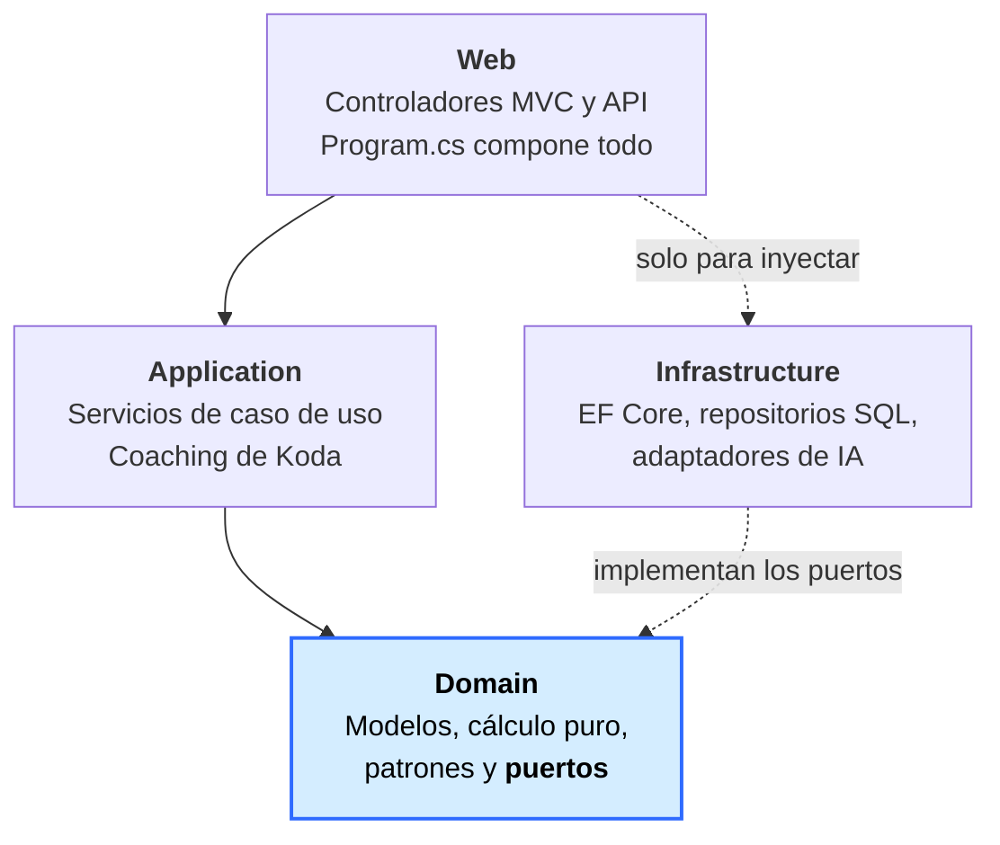
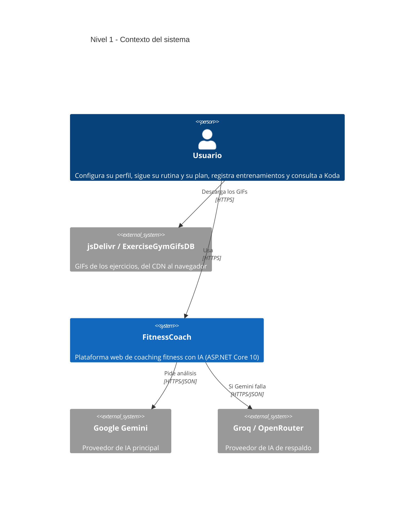

<div align="center">


# FitnessCoach

**Entrenador personal con IA: rutinas, nutrición y un coach que mira tus datos reales.**

Proyecto académico de Arquitectura de Software — Tecnológico de Software


</div>

---

## Índice

1. [Qué es](#qué-es)
2. [Capturas](#capturas)
3. [Funcionalidades](#funcionalidades)
4. [Arquitectura](#arquitectura)
5. [Diagramas C4](#diagramas-c4)
6. [Evaluación ATAM](#evaluación-atam)
7. [Patrones de diseño](#patrones-de-diseño)
8. [Tecnologías](#tecnologías)
9. [Cómo correrlo](#cómo-correrlo)
10. [Pruebas y calidad](#pruebas-y-calidad)
11. [Documentación](#documentación)
12. [Despliegue](#despliegue)
13. [Ramas del repositorio](#ramas-del-repositorio)
14. [Créditos y licencias](#créditos-y-licencias)
15. [Cláusula de uso de IA](#cláusula-de-uso-de-ia)

---

## Qué es

FitnessCoach arma la **rutina** de cada usuario desde un catálogo de **1323 ejercicios** con GIF e instrucciones, y su **plan de comidas** desde un catálogo de **67 alimentos** con macros de la USDA. Encima hay un tracker (peso, entrenamientos, récords, diario de comidas), una capa de gamificación derivada de esos hechos, y **Koda**: un coach con IA que responde y analiza el progreso, la dieta, la rutina y la semana **con los datos reales del usuario, sin inventar**.

Lo que lo distingue de un CRUD de gimnasio:

- **Nada de contenido escrito a mano en el código.** Rutinas y planes de comida se *componen* desde datos, aplicando estrategias por objetivo.
- **La IA no puede inventar.** Recibe el perfil, el plan, la rutina, el diario y el catálogo, con reglas explícitas de no fabricar datos. Si ningún proveedor responde, un coach offline contesta por reglas: **nunca se cae**.
- **La gamificación se deriva, no se guarda.** Nivel, XP, logros y misiones se calculan desde el tracker, así que no puede desincronizarse con la realidad.
- **Cada decisión está documentada.** 21 ADRs, un inventario de deuda técnica y un roadmap de 12 fases, todas cerradas.

---

## Capturas

<div align="center">

### Inicio y Koda


### Rutina generada desde el catálogo


### Perfil y plan de alimentación


### Progreso y logros


</div>

---

## Funcionalidades

| Área | Qué hace |
|------|----------|
| **Cuentas** | Registro, login y logout con ASP.NET Identity. Los datos de cada usuario están aislados: el dueño sale de la identidad, nunca de la URL. |
| **Perfil** | Datos físicos, objetivo, zona horaria (autodetectada del navegador) y calorías diarias por Mifflin-St Jeor. |
| **Rutina** | Compuesta por objetivo desde el catálogo, con calentamiento y enfriamiento automáticos, GIF, instrucciones y técnica de cada ejercicio. |
| **Alimentación** | Macros calculados (proteína por peso, grasa por % del total, carbohidratos por diferencia), plan armado desde el catálogo, sustituciones por equivalencia de macros y preferencias (dietas y alimentos excluidos). |
| **Diario** | Registro de lo comido por día, con barras contra el objetivo. |
| **Progreso** | Historial de peso con gráfica, entrenamientos completados, rachas y récords personales por ejercicio. |
| **Logros** | Nivel y XP, 12 logros y 3 misiones semanales, derivados de los hechos del tracker. |
| **Koda (IA)** | Chat y análisis por pantalla, con cadena de proveedores y respaldo offline. |
| **API REST** | Documentada con OpenAPI + Scalar. Cubre perfil, calorías, historial de peso (alta, edición, borrado) y entrenamientos con rachas. |

---

## Arquitectura

**Hexagonal (Ports & Adapters)** en cuatro proyectos. La regla que la sostiene: las dependencias apuntan **hacia** el dominio.

```
FitnessCoach.Domain          # Modelos, puertos, cálculo puro y patrones GOF. No referencia a nadie.
FitnessCoach.Application     # Servicios de aplicación y casos de uso. Solo referencia Domain.
FitnessCoach.Infrastructure  # Adaptadores: EF Core + SQL Server, Identity, proveedores de IA.
FitnessCoach (raíz)          # Controladores MVC y API, vistas Razor. Program.cs es el composition root.
FitnessCoach.Tests           # xUnit, sin Moq (dobles a mano). No referencia Infrastructure (ADR-08).
```

Que `Domain` no referencie a nadie es lo que permite, por ejemplo, cambiar SQL Server por PostgreSQL o sumar un
proveedor de IA nuevo **sin tocar una sola regla de negocio**.

---

## Diagramas C4

Todos están en **[docs/diagrama-arquitectura.md](docs/diagrama-arquitectura.md)**, escritos en Mermaid y renderizados
por GitHub. Cada uno responde **una sola** pregunta, en vez de intentar mostrar el sistema entero de una vez:

| Diagrama | Qué pregunta responde |
|---|---|
| [Nivel 1 — Contexto](docs/diagrama-arquitectura.md#nivel-1--contexto-del-sistema) | ¿Quién usa el sistema y de qué depende afuera? |
| [Nivel 2 — Contenedores](docs/diagrama-arquitectura.md#nivel-2--contenedores) | ¿En qué piezas desplegables se divide? |
| [Nivel 3.1 — Capas](docs/diagrama-arquitectura.md#nivel-31--las-capas-y-la-regla-de-dependencias) | ¿Cómo se apilan y por qué las flechas van hacia el dominio? |
| [Nivel 3.2 — Armar una rutina](docs/diagrama-arquitectura.md#nivel-32--cómo-se-arma-una-rutina) | ¿Cómo trabajan juntos Strategy, Decorator y los puertos? |
| [Nivel 3.3 — Responder con Koda](docs/diagrama-arquitectura.md#nivel-33--cómo-responde-koda) | ¿Cómo se degrada la IA sin dejar de contestar? |
| [Inventario de componentes](docs/diagrama-arquitectura.md#inventario-de-componentes) | ¿Qué hay en cada capa, clase por clase? |

### La regla que sostiene todo



Las flechas apuntan **siempre hacia el dominio**. `Domain` no referencia a nadie e `Infrastructure` implementa los
puertos que aquél declara: por eso su flecha va al revés de lo esperable. Eso es la inversión de dependencias, y es
verificable — `FitnessCoach.Tests` **no referencia `Infrastructure`** (ADR-08).

### Contexto del sistema



> Ningún sistema externo es indispensable. Si los dos proveedores de IA fallan —o no hay red— responde un coach
> **offline** por reglas locales, dentro del propio proceso. Verificado en la prueba de fuego de la Fase 10.

---

## Evaluación ATAM

Evaluación de la arquitectura con **ATAM** (*Architecture Tradeoff Analysis Method*). No es un repaso de buenas
intenciones: cada punto sale de una decisión que **ya se tomó y ya se pagó** en este repositorio, y las cifras están
medidas, no estimadas.

Las tres categorías de ATAM no son sinónimos, y conviene no mezclarlas:

- **Punto de sensibilidad** — una decisión de la que depende **fuertemente un solo** atributo de calidad.
- **Punto de trade-off** — una decisión que toca **más de un** atributo: mejora uno y empeora otro.
- **Riesgo** — una decisión que puede impedir alcanzar un atributo bajo condiciones que son plausibles.

### Atributos de calidad priorizados

Ordenados como los ordena este proyecto; los de abajo se sacrificaron a conciencia por los de arriba.

| # | Atributo | Escenario concreto y medible |
|---|---|---|
| 1 | **Seguridad y aislamiento** | Un usuario autenticado que pide el `id` de un registro ajeno recibe **404**, nunca el dato. |
| 2 | **Disponibilidad de Koda** | Sin red y con las dos claves de IA caídas, el coach **igual responde**, con reglas locales. |
| 3 | **Mantenibilidad** | Agregar un alimento al catálogo es **una línea de JSON**, sin recompilar ni tocar el dominio. |
| 4 | **Rendimiento percibido** | Las pantallas pesadas resuelven en **≤ 6 consultas** a la base. |
| 5 | **Testabilidad** | El núcleo se prueba **sin base de datos y sin red**: 363 pruebas en ~370 ms. |
| 6 | **Portabilidad** | Corre en cualquier host con Docker; la imagen no lleva secretos ni cadena de conexión. |

### Puntos de sensibilidad

| Decisión | Atributo del que pende | Qué pasa si se cambia |
|---|---|---|
| `AsSplitQuery` al leer el perfil | Rendimiento | El perfil tiene **cuatro colecciones owned**; sin esto EF hace un producto cartesiano. Medido: `/Diario` pasó de **30 a 6** consultas, `/Progreso` de **20 a 6**, `/Rutinas` de **15 a 5**. |
| Caché de catálogos por Decorator | Rendimiento | Los 1323 ejercicios y 67 alimentos se leen de memoria. Sin la caché, armar una rutina consultaba SQL **una vez por bloque**. |
| Claves de Data Protection en la base | Continuidad de sesión | En disco, **cada despliegue desloguea a todos**. Es la decisión de la que depende que un redeploy no eche a los usuarios. |
| `Database.Migrate()` al arrancar | Disponibilidad en el despliegue | Es lo único que crea el esquema en una base nueva. Sin esto, el primer arranque en un servidor limpio no levanta. |
| Semilla del orden por `Id` del perfil | Variedad percibida | `OrdenEstable(slug)` hace la rutina determinista y reproducible; también hace que cada usuario vea **siempre los mismos** ejercicios. De ahí salió toda la Fase 12. |

### Puntos de trade-off

| Decisión | Qué mejora | Qué empeora | Veredicto |
|---|---|---|---|
| **Hexagonal en 4 proyectos** | Testabilidad y mantenibilidad. La regla de dependencias es **verificable**: `FitnessCoach.Tests` no referencia `Infrastructure`. | Ceremonia. Un caso de uso simple toca puerto, adaptador, servicio y controlador. | Aceptado. Es el objeto de estudio del proyecto y lo que permitió cambiar de repositorio en memoria a SQL sin tocar el dominio. |
| **Caché de catálogos en memoria** | Rendimiento (ver arriba). | Escalabilidad: **cada instancia tendría su copia**. | Aceptado: los catálogos se siembran al arrancar y nadie los edita en caliente. |
| **Cadena de IA con respaldo offline** | Disponibilidad: el usuario **nunca** ve un error de IA. | Latencia en el peor caso (hay que esperar que fallen tres proveedores) y **calidad**: el offline responde por reglas, no razona. | Aceptado. Un coach que a veces no contesta rompe el producto; uno que contesta más simple, no. |
| **Rutina generada al vuelo, no persistida** | Consistencia: no puede quedar desincronizada del perfil. | Flexibilidad: no se puede editar libremente. Obligó a modelar las sustituciones como un mapa `original → elegido` (D-36). | Aceptado, con el costo pagado en la Fase 12. |
| **Gamificación derivada de los hechos** | Consistencia: **no existe estado de juego** que pueda desincronizarse. | Cómputo: el nivel, los logros y las misiones se recalculan en cada carga. | Aceptado: es cálculo puro sobre datos ya en memoria. |
| **Rate limiter en memoria, sin Redis** | Simplicidad y costo: cero infraestructura extra. | Correctitud del límite con más de una instancia: **se multiplica por la cantidad de nodos**. | Aceptado para una sola instancia, y **escrito en el código** para que no sorprenda (D-24). |
| **SQL Server en vez de PostgreSQL** | Cero costo de migración: las migraciones y el `HasFilter` ya son de SQL Server. | Portabilidad y **opciones de hosting**: obliga a Express (10 GB) y a un proveedor que hable SQL Server. | **Es el trade-off que más cuesta hoy** (D-35). Migrar exige *regenerar* las migraciones con Npgsql, no editarlas, porque además PostgreSQL distingue mayúsculas y SQL Server no. |
| **GIFs desde un CDN externo** | Peso del repositorio y ninguna redistribución de material ajeno. | Dependencia de un tercero y **licencia sin declarar** en el origen. | Acotado: la URL está pineada a una versión y la cadena de medios degrada a placeholder si el CDN falla (D-29). |
| **Font Awesome como subconjunto propio** | Independencia y peso: **12 KB** contra ~360 KB del CDN. Cero peticiones a terceros. | Agregar un icono nuevo obliga a volver a correr el script de recorte. | Aceptado; el script queda versionado junto a la fuente (D-34). |

### Riesgos

| Riesgo | Atributo afectado | Estado |
|---|---|---|
| **Una sola instancia, sin redundancia.** Si el proceso cae, no hay app. | Disponibilidad | Asumido. No hay balanceador ni réplica; es un proyecto académico. |
| **Hosting atado a SQL Server.** Las plataformas gratuitas suelen ofrecer PostgreSQL, no SQL Server. | Portabilidad | **Materializado** — es exactamente el problema del despliegue final. Registrado como D-35. |
| **Las claves de IA son de capa gratuita.** Si se agota la cuota, todos los usuarios caen al coach offline. | Calidad de la IA | Mitigado por la cadena: degrada, no falla. |
| **Si una migración falla en producción, la app no levanta.** | Disponibilidad | **Deliberado**: es preferible fallar al arrancar que servir con el esquema equivocado. |
| **Los adaptadores de red no tienen pruebas** (ADR-08). | Testabilidad | Asumido: probarlos exigiría o red real o dobles del protocolo HTTP. Se compensó con la prueba de fuego manual. |
| **Licencia de los GIFs sin declarar por el origen.** | Legal | Abierto (D-29). Es el motivo por el que no se incluyen en el repositorio. |

### No-riesgos

Cosas que **parecen** riesgos y no lo son, porque hay evidencia de que no lo son:

- **Filtración de datos entre usuarios.** Verificado con dos cuentas: todo `id` ajeno responde 404 en GET, PUT y DELETE.
- **Quedarse sin respuesta de Koda.** El último eslabón de la cadena corre dentro del proceso y no usa red.
- **Perder el CDN de los GIFs.** La cadena de medios degrada a placeholder sin romper la pantalla.
- **Que el dominio se contamine con el framework.** Es verificable por compilación, no por disciplina: `Domain` no referencia a nadie.
- **Perder la sesión al redesplegar.** Probado matando y relanzando el proceso con la sesión viva.

> **Cómo se llegó a esto.** Ninguna de estas filas es una opinión: la de rendimiento sale del log de EF, la de sesiones
> de matar el proceso a mano, la de aislamiento de correr dos usuarios en paralelo, y la de portabilidad de arrancar
> contra una base **vacía** y ver aplicarse las 14 migraciones. El detalle está en los [ADRs](#documentación).

---

## Patrones de diseño

| Patrón | Dónde | Para qué |
|--------|-------|----------|
| **Strategy** | `Domain/Patterns/Strategy/` | Una estrategia por objetivo, para rutinas y para alimentación. |
| **Decorator** | `Domain/Patterns/Decorator/` y `Infrastructure/Repositories/*EnCache` | Calentamiento y enfriamiento sobre cualquier rutina; y la caché de catálogos, que envuelve al adaptador SQL implementando el mismo puerto. |
| **Factory Method** | `ObjetivoFitnessFactory`, `FabricaProveedoresIA` | Reconstruir el objetivo desde la BD; armar los proveedores de IA según la configuración disponible. |
| **Chain of Responsibility** | `Application/Coaching/CoachResiliente` | Recorrer los proveedores de IA hasta que uno responda, con el offline como último eslabón que no puede fallar. |

---

## Tecnologías

| | Tecnología | Para qué se usa |
|---|---|---|
|  | **.NET 10 / ASP.NET Core** | MVC y Web API en un mismo proceso |
|  | **C#** | Todo el backend |
|  | **EF Core 10** | Persistencia, migraciones y tipos owned |
|  | **SQL Server** | LocalDB en desarrollo, Express al desplegar |
|  | **Bootstrap 5** | Grilla y componentes base, sobre un sistema de diseño propio |
|  | **JavaScript vanilla** | La capa de vida de Koda y las medallas en canvas, sin librerías |
|  | **Font Awesome 6** | Iconografía, autohospedada como subconjunto de 12 KB |
|  | **Gemini / Groq** | Proveedores de IA, ambos en capa gratuita |
|  | **OpenAPI + Scalar** | Documentación viva de la API |
|  | **GitHub Actions** | Integración continua en cada push y PR |

---

## Cómo correrlo

```bash
# 1. Restaurar y compilar
dotnet restore
dotnet build

# 2. Crear la base (LocalDB por defecto, ver appsettings.json)
dotnet ef database update --project FitnessCoach.Infrastructure --startup-project FitnessCoach.csproj

# 3. Levantar
dotnet run --project FitnessCoach.csproj
```

Los catálogos de ejercicios y alimentos se siembran solos al arrancar, desde los JSON de
`FitnessCoach.Infrastructure/Data/`.

### Claves de IA (opcionales)

Sin ninguna clave la app funciona: Koda responde con el coach offline. Para usar los proveedores reales, en
user-secrets (nunca en `appsettings.json`):

```bash
dotnet user-secrets set "Gemini:ApiKey" "tu-clave"
dotnet user-secrets set "Groq:ApiKey" "tu-clave"     # respaldo de otra empresa, capa gratuita
```

---

## Pruebas y calidad

```bash
dotnet test
```

- **363 pruebas** en xUnit, sin librerías de mocking: los dobles se escriben a mano (`FitnessCoach.Tests/Fakes/`).
- `FitnessCoach.Tests` **no referencia** `Infrastructure`: se prueba el dominio y la aplicación, no los adaptadores (ADR-08).
- **CI en cada push y PR** con GitHub Actions, sobre Linux — lo que además valida que las fechas se cuenten bien en UTC.
- Cada fase cierra con la **prueba de fuego** de `03-ESTANDARES.md` §7: dos usuarios aislados, ids ajenos, datos basura,
  API sin sesión, guardados simultáneos, IA sin internet y persistencia tras reiniciar.

---

## Documentación

El set de contexto vive en [docs/contexto/](docs/contexto/) y se mantiene al día fase por fase:

| Documento | Contenido |
|-----------|-----------|
| [00-INDICE.md](docs/contexto/00-INDICE.md) | Cómo usar el set y estado actual |
| [01-PROYECTO.md](docs/contexto/01-PROYECTO.md) | Qué hay hecho, qué no, e historial de ADRs |
| [02-ARQUITECTURA.md](docs/contexto/02-ARQUITECTURA.md) | Reglas de dependencias y patrones |
| [03-ESTANDARES.md](docs/contexto/03-ESTANDARES.md) | Convenciones, accesibilidad, fechas y prueba de fuego |
| [04-DEUDA-TECNICA.md](docs/contexto/04-DEUDA-TECNICA.md) | Inventario honesto de lo que está mal |
| [05-VISION-PRODUCTO.md](docs/contexto/05-VISION-PRODUCTO.md) | Hacia dónde va el producto |
| [06-ROADMAP.md](docs/contexto/06-ROADMAP.md) | Las diez fases, cerradas |

Los **21 ADR** están en [docs/](docs/): del **ADR-01 al ADR-06** documentan las decisiones iniciales (patrón, vistas
arquitectónicas, hexagonal, API REST, patrones GOF) y del **ADR-07 al ADR-21** cierra uno por cada fase del roadmap.

---

## Despliegue

La app está lista para desplegarse en cualquier host, sin proveedor elegido todavía. Arranca contra una base **vacía**:
aplica las migraciones pendientes y siembra los catálogos sola.

### Variables de entorno

| Variable | Obligatoria | Para qué |
|---|:---:|---|
| `ConnectionStrings__DefaultConnection` | **sí** | El valor de `appsettings.json` apunta a LocalDB, que solo existe en Windows de escritorio. Si falta —o sigue siendo LocalDB fuera de desarrollo— la app **no arranca** y lo dice. |
| `ASPNETCORE_ENVIRONMENT` | sí | `Production` |
| `Gemini__ApiKey` | no | Sin ella, Koda responde con el coach offline. |
| `Groq__ApiKey` | no | Segundo proveedor de la cadena. |
| `Despliegue__RedirigirAHttps` | según | Ponla en `false` si un proxy ya termina el TLS, o el redirect entra en **bucle infinito**. |
| `Despliegue__MigrarAlArrancar` | no | `true` por defecto. |
| `ForwardedHeaders__KnownProxies__0` | según | La IP del proxy, para que el límite de intentos cuente al cliente real y no al balanceador (D-24). |

### Con Docker

```bash
docker build -t fitnesscoach .
docker run -p 8080:8080   -e ASPNETCORE_ENVIRONMENT=Production   -e ConnectionStrings__DefaultConnection="Server=...;Database=FitnessCoachDb;User Id=...;Password=...;TrustServerCertificate=True"   -e Despliegue__RedirigirAHttps=false   fitnesscoach
```

La imagen corre como usuario **no root** y escucha en el **8080** (el 80 exige privilegios que ese usuario no tiene).

### Sin Docker

El CI publica un artefacto listo en cada push (`fitnesscoach-<sha>`), con los estáticos ya comprimidos en `.gz` y `.br`.
Se descarga, se descomprime y se corre con `dotnet FitnessCoach.dll`.

### Comprobar que quedó bien

`GET /health` abre una conexión real contra la base y responde `Healthy` (200) o `Unhealthy` (503). Sirve como sonda
para el balanceador o el proveedor.

### Detalles que ya están resueltos

- **Las claves de Data Protection viven en la base**, no en el disco del proceso. En un contenedor el disco es efímero:
  sin esto, **cada despliegue deslogueaba a todos los usuarios**.
- **Las migraciones se aplican al arrancar**, con el lock de EF Core, así que dos instancias arrancando a la vez no se
  pisan.
- **El CI construye la imagen en cada push** y comprueba que, sin cadena de conexión, falle rápido y con un mensaje
  entendible.

### La base de datos

Funciona con cualquier **SQL Server**: Express es gratis (límite de 10 GB; los catálogos son ~1400 filas) y no exige
cambiar una línea de código. PostgreSQL queda como alternativa registrada (**D-35**), con una advertencia: **PostgreSQL
distingue mayúsculas y SQL Server no**, así que las migraciones hay que **regenerarlas** con Npgsql, no editarlas.

---

## Ramas del repositorio

| Rama | Descripción |
|------|-------------|
| `CD/CI` | Rama de integración: el estado real y más avanzado del proyecto. |
| `fase-N/...` | Una rama por fase del roadmap, cada una con su PR y su ADR. |
| `master` | Rama por defecto, al día con `CD/CI`. |
| `mvc-inicial`, `api-layer` | Estados históricos: MVC puro y la incorporación de la capa API. |

---

## Créditos y licencias

**© 2026 Mateo Martin. Todos los derechos reservados.** El repositorio es público para mostrarse como trabajo
académico, pero **no lleva licencia de código abierto**: no se autoriza reutilizar el código sin permiso expreso.
El detalle está en [COPYRIGHT.md](COPYRIGHT.md).

Los recursos de terceros no quedan cubiertos por ese aviso y conservan sus propias licencias:

| Recurso | Origen | Licencia |
|---|---|---|
| Iconos | [Font Awesome Free 6.4.0](https://fontawesome.com) | Iconos CC BY 4.0 · fuentes SIL OFL 1.1 |
| Tipografías | Press Start 2P, Tomorrow (Google Fonts) | SIL OFL 1.1 |
| Bootstrap, jQuery | — | MIT |
| Imágenes de alimentos | Wikimedia Commons | CC BY-SA, con atribución en el catálogo |
| GIFs de ejercicios | [ExerciseGymGifsDB](https://github.com/) vía jsDelivr | Sin licencia declarada por el origen — ver **D-29** |
| Arte de Koda | Original del autor | — |

> El GIF de cada ejercicio lo pide el navegador al CDN; no se redistribuyen desde este repositorio. La licencia sin
> aclarar del conjunto está registrada como deuda **D-29** y es el motivo por el que no se los incluye en el repo.

---

## Cláusula de uso de IA

Este proyecto fue desarrollado con asistencia de herramientas de inteligencia artificial (Claude — Anthropic). El
trabajo se organizó por fases: para cada una se acordó un plan, la IA aplicó los cambios y el autor revisó el diff antes
de integrarlo. Las decisiones de arquitectura, alcance y producto —incluidas las documentadas en los ADRs— son del
autor, igual que el arte del personaje. Varias decisiones registradas en los ADRs salieron de correcciones del autor
sobre lo propuesto por la IA.

---

<div align="center">

*Tecnológico de Software — Desarrollo de Software y Negocios Digitales*
*Arquitectura de Software — Dr. Pedrozo — 2026*

</div>
