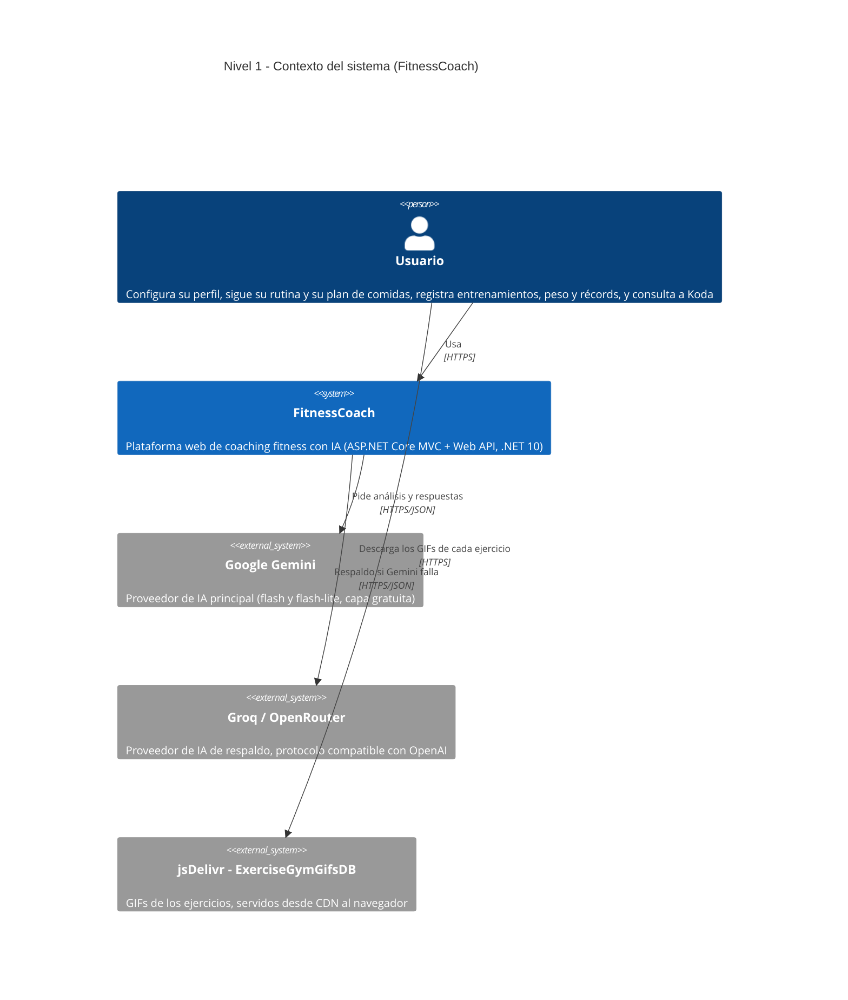
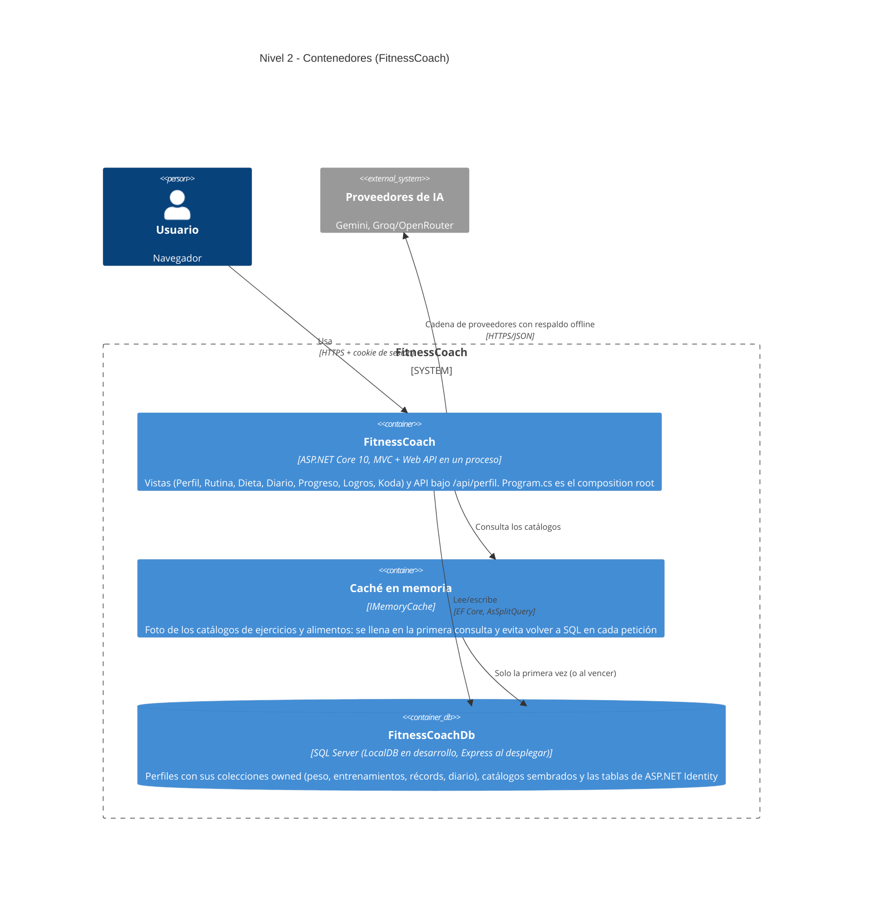
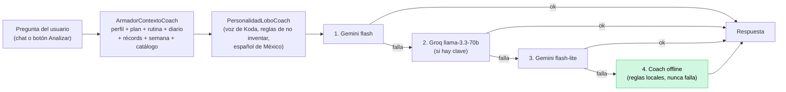

# Diagramas de arquitectura C4 — FitnessCoach

Estos diagramas reflejan el estado real del código al cerrar la **Fase 10** (rama `fase-10/optimizacion`, ADR-20).
Actualizados el 30/07/2026: la versión anterior era de la Fase 0 y todavía mostraba almacenamiento en memoria, sin autenticación, sin IA y sin catálogos.

## Nivel 1 — Contexto del sistema

**Lo importante del nivel 1:** ningún proveedor de IA es indispensable. Si los dos fallan (o no hay red), responde el
coach offline por reglas, dentro del propio proceso. Los GIFs los pide el **navegador** al CDN, no el servidor: si el
CDN no responde, la vista cae al placeholder local de Koda sin romper la página.

## Nivel 2 — Contenedores

**Por qué la caché es un contenedor propio:** cambia el patrón de acceso a datos. El catálogo se puebla por semilla al
arrancar y nadie lo modifica en caliente, así que las consultas por grupo muscular o categoría se responden desde
memoria. Armar una rutina consultaba SQL una vez por bloque de ejercicios.

## Nivel 3 — Componentes

```mermaid
flowchart TB
    subgraph WEB["FitnessCoach — Web (MVC + API, un proceso)"]
        direction TB
        Program["Program.cs<br/>(composition root, DI, rate limiter,<br/>UseForwardedHeaders)"]
        subgraph MVC["Controladores MVC"]
            PerfilCtrl["PerfilController<br/>(datos + zona horaria)"]
            RutinasCtrl["RutinasController"]
            AlimCtrl["AlimentacionController"]
            DiarioCtrl["DiarioController"]
            ProgresoCtrl["ProgresoController"]
            GamiCtrl["GamificacionController"]
            IaCtrl["IaCoachController<br/>(chat + Analizar)"]
            CuentaCtrl["AccountController<br/>(login, registro, logout)"]
        end
        subgraph API["Web API — /api/perfil"]
            UsuariosApi["UsuariosApiController<br/>(perfil, calorías)"]
            ProgresoApi["ProgresoApiController<br/>(GET/POST/PUT/DELETE)"]
            EntrenoApi["EntrenamientosApiController<br/>(historial, rachas, opciones)"]
        end
    end

    subgraph APP["FitnessCoach.Application"]
        direction TB
        SvcPerfil["ServicioPerfilUsuario<br/>(recuerda el perfil por petición)"]
        SvcProgreso["ServicioProgreso"]
        SvcEntreno["ServicioEntrenamientos<br/>(valida el día de rutina)"]
        SvcRecords["ServicioRecords"]
        SvcDiario["ServicioDiario"]
        SvcGami["ServicioGamificacion"]
        Zona["ZonaHorariaUsuario<br/>(qué día es para el usuario)"]
        Rachas["CalculadorRachas"]
        GenRutinas["GeneradorRutinasService"]
        GenAlim["GeneradorAlimentacionService"]
        Coach["CoachResiliente<br/>(Chain of Responsibility)"]
        Armador["ArmadorContextoCoach"]
        Personalidad["PersonalidadLoboCoach<br/>(la voz de Koda)"]
        Offline["CoachOfflineService<br/>(reglas, sin red, nunca falla)"]
    end

    subgraph DOMAIN["FitnessCoach.Domain — núcleo, sin framework"]
        direction TB
        Puertos["Puertos: IRepositorioUsuario,<br/>IRepositorioEjercicios, IRepositorioAlimentos,<br/>IProveedorIA, IFabricaProveedoresIA"]
        Modelos["Modelos: UsuarioPerfil (+ owned:<br/>progreso, entrenamientos, récords, diario),<br/>Ejercicio, Alimento, Rutina"]
        Calculos["Cálculo puro: CalculadorMacros,<br/>CalculadorXP, CalculadorNivel,<br/>EvaluadorLogros, CalculadorMisiones"]
        Indices["IndiceEjercicios / IndiceAlimentos<br/>(foto inmutable de los catálogos)"]
        Estrategias["Strategy: una estrategia por objetivo<br/>(rutina y alimentación)"]
        Decoradores["Decorator: RutinaConCalentamiento,<br/>RutinaConEnfriamiento"]
    end

    subgraph INFRA["FitnessCoach.Infrastructure"]
        direction TB
        RepoUsuario["RepositorioUsuarioSql<br/>(AsSplitQuery)"]
        RepoEjerCache["RepositorioEjerciciosEnCache<br/>(Decorator)"]
        RepoAlimCache["RepositorioAlimentosEnCache<br/>(Decorator)"]
        RepoEjerSql["RepositorioEjerciciosSql"]
        RepoAlimSql["RepositorioAlimentosSql"]
        DbCtx["ApplicationDbContext<br/>(EF Core + Identity)"]
        Sembradores["Sembradores de catálogo<br/>(JSON -> SQL al arrancar)"]
        ProvGemini["GeminiCoachService"]
        ProvOpenAI["ProveedorOpenAICompatible<br/>(Groq / OpenRouter)"]
        Fabrica["FabricaProveedoresIA<br/>(Factory)"]
    end

    MVC --> APP
    API --> APP

    SvcPerfil --> Puertos
    SvcProgreso --> SvcPerfil
    SvcEntreno --> SvcPerfil
    SvcEntreno --> GenRutinas
    SvcEntreno --> Rachas
    SvcEntreno --> Zona
    SvcGami --> SvcPerfil
    SvcGami --> Calculos
    SvcGami --> Zona
    SvcDiario --> Puertos
    GenRutinas --> Estrategias
    GenAlim --> Estrategias
    Estrategias --> Decoradores
    Estrategias --> Puertos
    IaCtrl --> Coach
    Coach --> Armador
    Coach --> Personalidad
    Coach --> Puertos
    Coach --> Offline

    Puertos -.implementan.-> RepoUsuario
    Puertos -.implementan.-> RepoEjerCache
    Puertos -.implementan.-> RepoAlimCache
    Puertos -.implementan.-> ProvGemini
    Puertos -.implementan.-> ProvOpenAI
    Puertos -.implementan.-> Fabrica

    RepoEjerCache --> RepoEjerSql
    RepoEjerCache --> Indices
    RepoAlimCache --> RepoAlimSql
    RepoAlimCache --> Indices
    RepoUsuario --> DbCtx
    RepoEjerSql --> DbCtx
    RepoAlimSql --> DbCtx
    Sembradores --> DbCtx

    Program -.compone todo.-> INFRA

    classDef patron fill:#fff3cd,stroke:#333,color:#000;
    classDef nuevo fill:#d4edff,stroke:#2f6bff,color:#000;
    class Estrategias,Decoradores,Coach,RepoEjerCache,RepoAlimCache patron;
    class Zona,Indices,EntrenoApi nuevo;
```

**Leyenda:** amarillo = patrón de diseño explícito; azul = piezas que agregó la Fase 10.

**La regla que sostiene el diagrama:** las flechas siempre apuntan **hacia** el dominio. `Domain` no referencia a
nadie; `Application` solo referencia a `Domain`; `Infrastructure` implementa los puertos de `Domain`; la capa web
compone. Por eso `IndiceEjercicios` quedó en `Domain` y no en `Application`: lo usa un adaptador de
`Infrastructure`, que no referencia `Application`.

## Cadena de la IA (detalle del flujo)

Verificado en la prueba de fuego de la Fase 10: sin salida a internet, la cadena llega al eslabón offline y el
usuario recibe una respuesta útil en vez de un error.

> **Nota de nombres:** la clase de la voz sigue llamándose `PersonalidadLoboCoach` de cuando el coach era "el Lobo".
> El nombre visible es Koda desde la Fase 9; el de la clase quedó sin renombrar (D-32).
