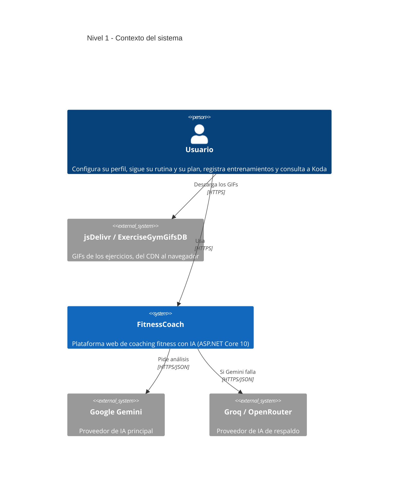
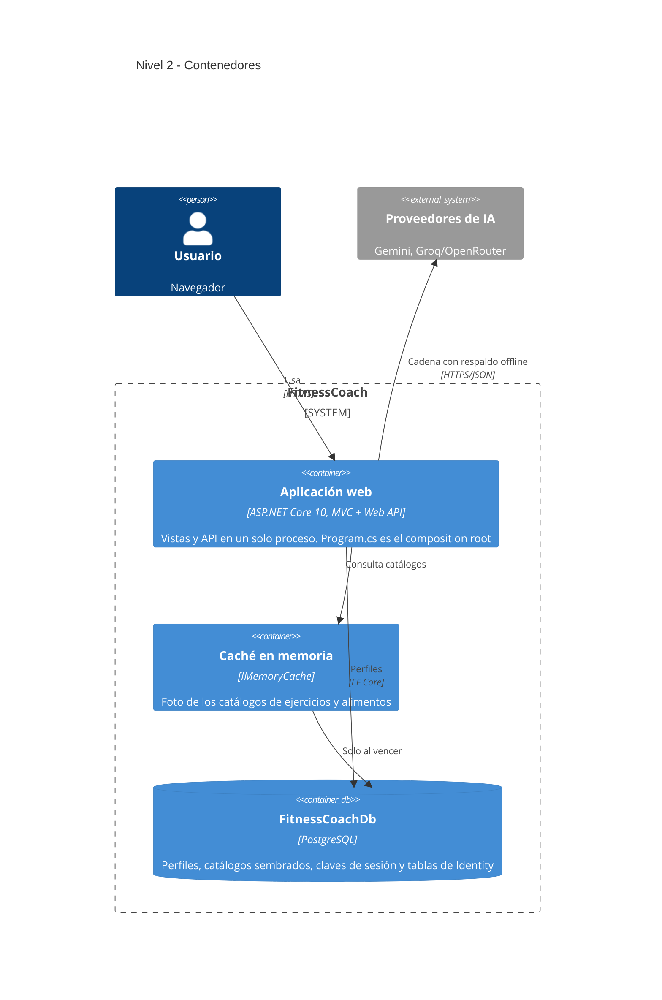
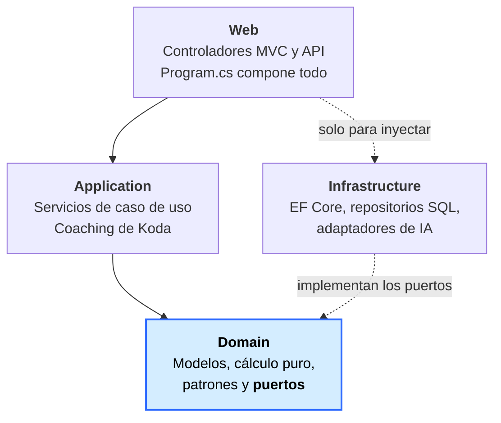
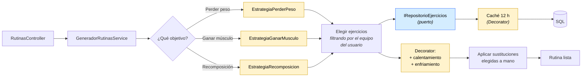
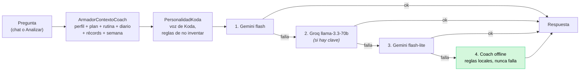

# Diagramas de arquitectura C4 — FitnessCoach

Estos diagramas reflejan el estado real del código al cerrar la **Fase 12** (ADR-21).

> **Cómo leerlos.** Cada diagrama responde **una** pregunta. El nivel 3 no es un mapa de todas las clases —eso es la
> tabla de componentes del final, que se lee mucho mejor— sino tres recorridos: cómo se apilan las capas, cómo se arma
> una rutina y cómo responde Koda.

**Índice**

1. [Nivel 1 — Contexto](#nivel-1--contexto-del-sistema)
2. [Nivel 2 — Contenedores](#nivel-2--contenedores)
3. [Nivel 3.1 — Las capas y la regla de dependencias](#nivel-31--las-capas-y-la-regla-de-dependencias)
4. [Nivel 3.2 — Cómo se arma una rutina](#nivel-32--cómo-se-arma-una-rutina)
5. [Nivel 3.3 — Cómo responde Koda](#nivel-33--cómo-responde-koda)
6. [Inventario de componentes](#inventario-de-componentes)

---

## Nivel 1 — Contexto del sistema

**Lo importante:** ningún sistema externo es indispensable. Si los dos proveedores de IA fallan —o no hay red— responde
el coach offline por reglas, dentro del propio proceso. Y los GIFs los pide el **navegador**, no el servidor: si el CDN
no contesta, la vista cae al placeholder local de Koda sin romper la página.

---

## Nivel 2 — Contenedores

**Por qué la caché es un contenedor propio:** cambia el patrón de acceso a datos. Los catálogos se pueblan por semilla
al arrancar y nadie los modifica en caliente, así que las consultas por grupo muscular o categoría se responden desde
memoria. Antes, armar una rutina consultaba SQL una vez por bloque de ejercicios.

---

## Nivel 3.1 — Las capas y la regla de dependencias

La única regla que sostiene toda la arquitectura: **las flechas apuntan siempre hacia el dominio.**

`Domain` no referencia a nadie. `Application` solo referencia a `Domain`. `Infrastructure` **implementa** los puertos
que `Domain` declara, y por eso la flecha va al revés de lo que uno esperaría: es la inversión de dependencias.

Esa regla tiene consecuencias concretas y verificables:

- `IndiceEjercicios` y `EquipoEntrenamiento` viven en `Domain`, no en `Application`, porque los usa un adaptador de
  `Infrastructure` —que no referencia `Application`—.
- `FitnessCoach.Tests` **no referencia `Infrastructure`** (ADR-08): todo lo que se prueba se prueba contra puertos, con
  dobles escritos a mano.

---

## Nivel 3.2 — Cómo se arma una rutina

El recorrido completo de una petición a `/Rutinas`, que es donde se ven trabajando juntos los tres patrones.

Amarillo = patrón de diseño explícito · azul = puerto del dominio.

**El orden importa y es deliberado.** El equipo del usuario filtra **antes** de elegir, porque prescribir algo que no
puede hacer es igual que no prescribir nada. Las sustituciones se aplican **al final**, después de componer y decorar,
porque son una decisión del usuario y no del objetivo: así deshacer una devuelve la prescripción original sin
recalcular nada (ADR-21).

---

## Nivel 3.3 — Cómo responde Koda

Es un **Chain of Responsibility**: cada eslabón intenta y, si falla, cede al siguiente. El último no puede fallar
porque no usa la red. Por eso Koda siempre contesta algo, incluso sin conexión.

El contexto se arma **antes** de preguntar: Koda ve los números reales del usuario y tiene instrucciones explícitas de
no inventar los que no ve.

---

## Inventario de componentes

Lo que un diagrama de treinta cajas no logra comunicar, una tabla sí.

### Web

| Componente | Qué hace |
|---|---|
| `HomeController` | Portada; sin sesión muestra la bienvenida de Koda |
| `AccountController` | Registro, login y logout |
| `PerfilController` | Datos que alimentan los cálculos |
| `AjustesController` | Cuenta, contraseña, zona horaria y equipo |
| `RutinasController` | Rutina y cambio de ejercicios |
| `AlimentacionController` · `DiarioController` | Plan de comidas y adherencia |
| `ProgresoController` · `GamificacionController` | Tracker, niveles y logros |
| `IaCoachController` | Chat y análisis de Koda |
| `UsuariosApi` · `ProgresoApi` · `EntrenamientosApi` | REST bajo `/api/perfil` |

### Application

| Componente | Qué hace |
|---|---|
| `ServicioPerfilUsuario` | Lee y guarda el perfil; lo recuerda por petición |
| `ServicioProgreso` · `ServicioRecords` | Peso y récords personales |
| `ServicioEntrenamientos` | Registra entrenos validando el día real de la rutina |
| `ServicioDiario` | Qué comió el usuario y cómo va contra sus macros |
| `ServicioGamificacion` | Nivel, logros y misiones derivados de los hechos |
| `ServicioSustitucionEjercicios` | Alternativas del mismo grupo muscular |
| `GeneradorRutinasService` · `GeneradorAlimentacionService` | Componen rutina y plan |
| `ZonaHorariaUsuario` | Única fuente de "qué día es para el usuario" |
| `CoachResiliente` · `ArmadorContextoCoach` · `CoachOfflineService` | La cadena de IA |

### Domain

| Componente | Qué hace |
|---|---|
| **Puertos** | `IRepositorioUsuario`, `IRepositorioEjercicios`, `IRepositorioAlimentos`, `IProveedorIA`, `IFabricaProveedoresIA` |
| **Modelos** | `UsuarioPerfil` (+ owned: progreso, entrenamientos, récords, diario), `Ejercicio`, `Alimento`, `Rutina` |
| **Preferencias** | `PreferenciasAlimentarias`, `PreferenciasEntrenamiento` |
| **Cálculo puro** | `CalculadorMacros`, `CalculadorXP`, `CalculadorNivel`, `EvaluadorLogros`, `CalculadorMisiones`, `CalculadorRachas` |
| **Catálogos** | `IndiceEjercicios`, `IndiceAlimentos`, `EquipoEntrenamiento`, `EtiquetasEjercicio` |
| **Strategy** | Una estrategia por objetivo, para rutina y para alimentación |
| **Decorator** | `RutinaConCalentamiento`, `RutinaConEnfriamiento` |

### Infrastructure

| Componente | Qué hace |
|---|---|
| `ApplicationDbContext` | EF Core + Identity |
| `RepositorioUsuarioSql` | Perfil completo con `AsSplitQuery` |
| `RepositorioEjerciciosEnCache` · `RepositorioAlimentosEnCache` | Decorators de caché sobre los repositorios SQL |
| `RepositorioEjerciciosSql` · `RepositorioAlimentosSql` | Acceso real a las tablas |
| Sembradores de catálogo | JSON → SQL al arrancar, solo si la tabla está vacía |
| `GeminiCoachService` · `ProveedorOpenAICompatible` | Adaptadores de IA |
| `FabricaProveedoresIA` | Factory que arma la cadena según la configuración |

---

> **Nota:** `PersonalidadKoda` se llamaba `PersonalidadLoboCoach` hasta que se pagó la deuda **D-32**.
> El coach pasó a llamarse Koda en la Fase 9 y el nombre de la clase se había quedado atrás.
